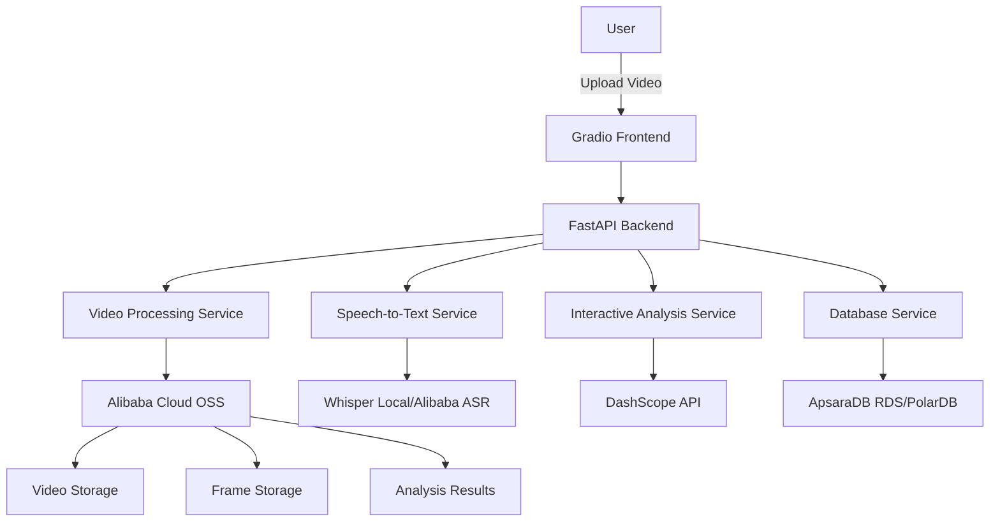
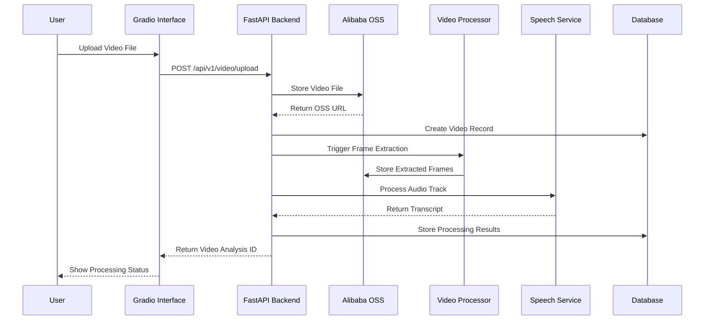
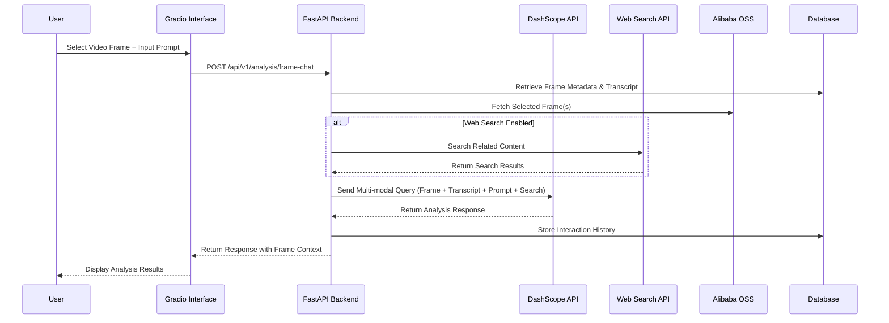
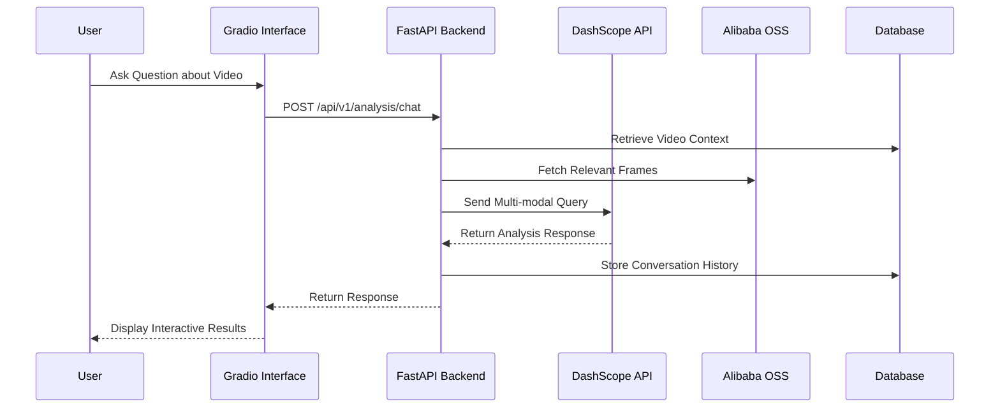
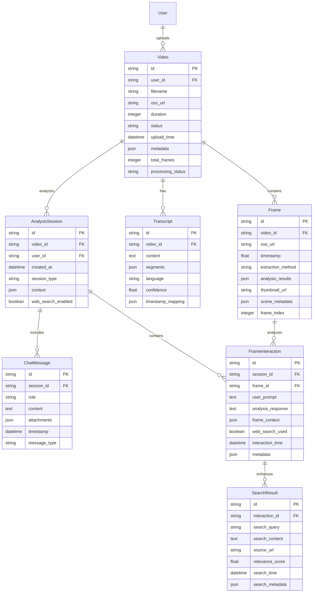

# Alibaba Cloud Video Analysis Platform Design Document

## 1. Overview

### Project Transformation
Migrate the existing YouTube Summarizer application to a comprehensive video analysis platform running on Alibaba Cloud infrastructure. The platform will transition from YouTube link processing to user-uploaded video analysis with interactive multi-modal capabilities.

### Core Objectives
- **Cloud-Native Migration**: Full migration to Alibaba Cloud services ecosystem
- **Enhanced User Experience**: Interactive video analysis with multi-turn conversations
- **Modular Architecture**: Extensible design for future modules (similar to NotebookLM)
- **Simplified Frontend**: Replace React frontend with Gradio interface
- **Scalable Storage**: Leverage Alibaba Cloud OSS for video and data storage

### Key Functional Changes
- **Input Method**: From YouTube URLs to direct video upload
- **Processing Workflow**: From immediate summary generation to interactive analysis
- **User Interface**: From React web app to Gradio-based interface
- **Storage Architecture**: From local SQLite/JSON to cloud-native solutions

## 2. Architecture Overview

### High-Level Architecture Pattern



### Technology Stack Migration

| Component | Current | Target | Rationale |
|-----------|---------|--------|-----------|
| Frontend | React + Ant Design | Gradio | Rapid prototyping, built-in ML interface |
| Backend | FastAPI | FastAPI (Enhanced) | Maintain existing API structure |
| Database | SQLite | ApsaraDB RDS/PolarDB | Scalability and cloud integration |
| Storage | Local Files/GCS | Alibaba Cloud OSS | Native cloud storage solution |
| Speech-to-Text | OpenAI Whisper | Whisper SDK/Alibaba ASR | Cost optimization and performance |
| LLM Service | Qwen API | DashScope API | Native Alibaba Cloud integration |
| Deployment | Docker Compose | ECS/Serverless | Cloud-native deployment |

## 3. Data Flow Architecture

### Video Upload and Processing Flow



### Interactive Frame Analysis Flow



### Enhanced Interactive Analysis Flow



## 4. Service Architecture Design

### Core Service Modules

#### 4.1 Video Upload Service
```python
# Modular service structure
class VideoUploadService:
    def __init__(self):
        self.oss_client = OSSClient()
        self.db_service = DatabaseService()
        
    async def upload_video(self, file: UploadFile) -> VideoUploadResponse:
        # Upload to OSS
        # Create database record
        # Trigger processing pipeline
        pass
```

#### 4.2 Video Processing Service
```python
class VideoProcessingService:
    def __init__(self):
        self.frame_extractor = FrameExtractionService()
        self.oss_client = OSSClient()
        
    async def process_video(self, video_id: str) -> ProcessingResult:
        # Extract frames using multiple methods
        # Store frames to OSS
        # Update processing status
        pass
```

#### 4.3 Speech-to-Text Service
```python
class SpeechToTextService:
    def __init__(self):
        self.whisper_service = WhisperLocalService()
        self.alibaba_asr = AlibabaASRService()
        
    async def transcribe_audio(self, audio_path: str) -> TranscriptionResult:
        # Choose between local Whisper or Alibaba ASR
        # Return structured transcript
        pass
```

#### 4.4 Interactive Analysis Service
```python
class InteractiveAnalysisService:
    def __init__(self):
        self.dashscope_client = DashScopeClient()
        self.context_manager = ContextManager()
        self.web_search_service = WebSearchService()
        
    async def analyze_video_content(self, query: str, video_id: str) -> AnalysisResponse:
        # Retrieve video context and frames
        # Generate multi-modal response
        # Maintain conversation history
        pass
    
    async def analyze_frame_with_prompt(self, 
                                       frame_selection: FrameSelection,
                                       prompt: str,
                                       video_id: str,
                                       enable_web_search: bool = False) -> FrameAnalysisResponse:
        # Retrieve selected frame(s) and associated metadata
        # Get transcript segment for selected timestamp
        # Optionally perform web search for additional context
        # Generate comprehensive multi-modal analysis
        pass

class FrameInteractionService:
    def __init__(self):
        self.oss_client = OSSClient()
        self.db_service = DatabaseService()
        
    async def get_frame_timeline(self, video_id: str) -> FrameTimeline:
        # Return all extracted frames with timestamps
        # Include frame thumbnails and metadata
        pass
    
    async def get_frame_context(self, video_id: str, timestamp: float) -> FrameContext:
        # Retrieve frame image from OSS
        # Get corresponding transcript segment
        # Fetch nearby frames for context
        # Return comprehensive frame information
        pass
```

#### 4.5 Web Search Integration Service
```python
class WebSearchService:
    def __init__(self):
        self.search_client = SearchClient()  # Alibaba Cloud Search or external API
        
    async def search_related_content(self, 
                                   query: str, 
                                   frame_context: str = None) -> SearchResults:
        # Enhance query with frame context if available
        # Perform web search for relevant information
        # Filter and rank results by relevance
        # Return structured search results
        pass
    
    async def enhance_analysis_with_search(self, 
                                         analysis_context: str) -> EnhancedContext:
        # Extract key topics from analysis context
        # Search for additional information
        # Merge search results with existing context
        pass
```

## 5. Database Schema Design

### Core Data Models



### Database Migration Strategy

| Current Model | Target Model | Migration Notes |
|---------------|--------------|-----------------|
| Summary | AnalysisSession | Extend functionality for interactive sessions |
| User | User | Maintain existing structure with cloud enhancements |
| N/A | Video | New entity for uploaded videos |
| N/A | Frame | New entity for extracted frames |
| N/A | Transcript | New entity for speech-to-text results |

## 6. Alibaba Cloud Services Integration

### 6.1 Object Storage Service (OSS)
```python
class OSSStorageService:
    def __init__(self):
        self.bucket_name = "video-analysis-bucket"
        self.client = oss2.Bucket(auth, endpoint, bucket_name)
    
    async def upload_video(self, file_path: str, object_key: str) -> str:
        # Upload video with automatic compression
        # Set appropriate storage class (Standard/IA/Archive)
        # Return public URL or signed URL
        pass
    
    async def upload_frames(self, frames: List[Frame], video_id: str) -> List[str]:
        # Batch upload extracted frames
        # Organize in hierarchical structure
        pass
```

### 6.2 Speech-to-Text Integration
```python
class AlibabaASRService:
    def __init__(self):
        self.client = NlsClient()
    
    async def transcribe_file(self, audio_url: str) -> TranscriptionResult:
        # Support for multiple languages (Chinese, English, Korean)
        # Real-time or batch processing
        # Return structured results with timestamps
        pass
```

### 6.3 DashScope LLM Integration
```python
class DashScopeService:
    def __init__(self):
        self.client = DashScope()
    
    async def analyze_multimodal(self, text: str, images: List[str]) -> AnalysisResponse:
        # Multi-modal analysis with Qwen-VL
        # Support for video frame analysis
        # Conversation context management
        pass
```

## 7. Gradio Interface Design

### 7.1 Interface Layout Structure
```python
def create_gradio_interface():
    with gr.Blocks(title="Video Analysis Platform") as interface:
        with gr.Tab("Video Upload"):
            video_upload = gr.File(file_types=["mp4", "avi", "mov"])
            upload_btn = gr.Button("Process Video")
            processing_status = gr.Textbox(label="Processing Status", interactive=False)
            
        with gr.Tab("Interactive Analysis"):
            video_selector = gr.Dropdown(label="Select Video")
            chatbot = gr.Chatbot()
            query_input = gr.Textbox(placeholder="Ask about the video...")
            web_search_toggle = gr.Checkbox(label="Enable Web Search", value=False)
            
        with gr.Tab("Frame-by-Frame Analysis"):
            with gr.Row():
                with gr.Column(scale=2):
                    # Frame timeline selector
                    frame_timeline = gr.Gallery(
                        label="Video Timeline - Click to Select Frame",
                        show_label=True,
                        elem_id="frame_timeline",
                        columns=8,
                        rows=2,
                        height="200px"
                    )
                    
                    # Selected frame display
                    selected_frame = gr.Image(
                        label="Selected Frame",
                        interactive=False,
                        height=400
                    )
                    
                    # Frame metadata
                    frame_metadata = gr.JSON(
                        label="Frame Context",
                        visible=True
                    )
                    
                with gr.Column(scale=3):
                    # Analysis prompt input
                    analysis_prompt = gr.Textbox(
                        label="Analysis Prompt",
                        placeholder="Describe what you want to analyze about this frame...",
                        lines=3
                    )
                    
                    # Web search option
                    enable_search = gr.Checkbox(
                        label="Include Web Search",
                        value=False
                    )
                    
                    # Analysis button
                    analyze_btn = gr.Button(
                        "Analyze Frame",
                        variant="primary"
                    )
                    
                    # Analysis results
                    analysis_results = gr.Chatbot(
                        label="Frame Analysis Results",
                        height=400
                    )
                    
                    # Transcript context
                    transcript_context = gr.Textbox(
                        label="Transcript at Selected Time",
                        lines=4,
                        interactive=False
                    )
            
        with gr.Tab("Multi-Frame Comparison"):
            with gr.Row():
                with gr.Column():
                    frame_selector_1 = gr.Gallery(label="Select First Frame")
                    frame_selector_2 = gr.Gallery(label="Select Second Frame")
                    
                with gr.Column():
                    comparison_prompt = gr.Textbox(
                        label="Comparison Analysis",
                        placeholder="Compare these frames..."
                    )
                    compare_btn = gr.Button("Compare Frames")
                    comparison_results = gr.Chatbot()
                    
    return interface
```

### 7.2 Interactive Components

| Component | Purpose | Implementation |
|-----------|---------|----------------|
| Video Upload | File upload with progress | gr.File + custom progress tracking |
| Video Gallery | Display processed videos | gr.Gallery with OSS URLs |
| Chat Interface | Multi-turn conversation | gr.Chatbot with history |
| Frame Timeline | Interactive frame selection | gr.Gallery with click handlers |
| Frame Analyzer | Frame-specific analysis | gr.Image + gr.Textbox + gr.Chatbot |
| Web Search Toggle | Enable/disable web search | gr.Checkbox with state management |
| Multi-Frame Comparison | Compare multiple frames | Dual gr.Gallery + comparison interface |
| Transcript Display | Show contextual transcript | gr.Textbox with timestamp sync |
| Analysis Results | Display structured outputs | gr.JSON + gr.Markdown |

### 7.3 Frame Interaction Workflow

```python
def setup_frame_interaction_handlers():
    def on_frame_select(selected_frame_index, video_id):
        # Get frame data from backend
        frame_data = get_frame_context(video_id, selected_frame_index)
        
        return {
            selected_frame: frame_data.image_url,
            frame_metadata: frame_data.metadata,
            transcript_context: frame_data.transcript_segment
        }
    
    def on_analyze_frame(prompt, video_id, frame_timestamp, enable_search):
        # Send analysis request to backend
        analysis_request = {
            "prompt": prompt,
            "video_id": video_id,
            "frame_timestamp": frame_timestamp,
            "enable_web_search": enable_search
        }
        
        response = analyze_frame_with_context(analysis_request)
        
        return {
            analysis_results: response.analysis,
            # Update chat history with new interaction
        }
    
    # Bind event handlers
    frame_timeline.select(on_frame_select)
    analyze_btn.click(on_analyze_frame)
```

## 8. Modular Extension Architecture

### 8.1 Plugin System Design
```python
class ModuleInterface:
    """Base interface for all analysis modules"""
    
    @abstractmethod
    async def process(self, context: AnalysisContext) -> ModuleResult:
        pass
    
    @abstractmethod
    def get_capabilities(self) -> List[str]:
        pass

class NotebookLMModule(ModuleInterface):
    """Future module for notebook-style learning content generation"""
    
    async def process(self, context: AnalysisContext) -> ModuleResult:
        # Generate learning materials from video content
        # Create interactive notebooks
        pass

class BlogGeneratorModule(ModuleInterface):
    """Module for generating blog posts from video content"""
    
    async def process(self, context: AnalysisContext) -> ModuleResult:
        # Extract key points from video
        # Generate structured blog content
        pass
```

### 8.2 Extension Points

| Extension Point | Purpose | Interface |
|-----------------|---------|-----------|
| Analysis Modules | Custom analysis capabilities | ModuleInterface |
| Storage Adapters | Different storage backends | StorageInterface |
| LLM Providers | Multiple LLM service support | LLMInterface |
| Export Formats | Various output formats | ExportInterface |

## 9. Performance and Scalability Considerations

### 9.1 Video Processing Optimization
- **Parallel Frame Extraction**: Process multiple frames simultaneously
- **Adaptive Quality**: Adjust processing based on video characteristics
- **Caching Strategy**: Cache frequently accessed analysis results
- **Batch Processing**: Group similar operations for efficiency

### 9.2 Storage Optimization
- **Intelligent Tiering**: Automatic migration to appropriate OSS storage classes
- **CDN Integration**: Use Alibaba Cloud CDN for frame delivery
- **Compression**: Optimize video and frame storage sizes
- **Cleanup Policies**: Automatic removal of temporary files

### 9.3 API Performance
- **Async Processing**: Non-blocking video processing operations
- **Result Caching**: Redis integration for fast response times
- **Rate Limiting**: Protect against abuse and ensure fair usage
- **Load Balancing**: Distribute requests across multiple instances

## 10. Security and Access Control

### 10.1 Data Protection
- **Encryption at Rest**: OSS server-side encryption
- **Encryption in Transit**: HTTPS/TLS for all communications
- **Access Control**: IAM-based resource access management
- **Data Isolation**: User data segregation and privacy protection

### 10.2 Authentication and Authorization
```python
class SecurityService:
    def __init__(self):
        self.jwt_handler = JWTHandler()
        self.rbac = RBACManager()
    
    async def authenticate_user(self, token: str) -> User:
        # Validate JWT token
        # Load user permissions
        pass
    
    async def authorize_video_access(self, user: User, video_id: str) -> bool:
        # Check video ownership
        # Validate access permissions
        pass
```

## 11. Migration Strategy

### 11.1 Phase 1: Infrastructure Setup
1. Set up Alibaba Cloud environment (OSS, RDS, ECS)
2. Configure network security and access controls
3. Migrate user data and authentication system
4. Establish CI/CD pipelines

### 11.2 Phase 2: Core Service Migration
1. Implement video upload and storage service
2. Migrate speech-to-text functionality
3. Develop interactive analysis capabilities
4. Create Gradio interface foundation

### 11.3 Phase 3: Enhanced Features
1. Implement multi-modal analysis
2. Add frame-level interaction capabilities
3. Develop modular extension system
4. Performance optimization and testing

### 11.4 Phase 4: Production Deployment
1. Load testing and performance validation
2. Security audit and compliance verification
3. User acceptance testing
4. Production rollout with monitoring

## 13. API Endpoint Specifications

### 13.1 Frame Interaction Endpoints

```python
# Frame Timeline and Selection
@app.get("/api/v1/video/{video_id}/frames")
async def get_video_frames(video_id: str) -> FrameTimelineResponse:
    """
    Get all frames for a video with timeline information
    Returns: List of frames with thumbnails, timestamps, and metadata
    """
    pass

@app.get("/api/v1/video/{video_id}/frame/{timestamp}")
async def get_frame_context(video_id: str, timestamp: float) -> FrameContextResponse:
    """
    Get detailed context for a specific frame
    Returns: Frame image, metadata, transcript segment, nearby frames
    """
    pass

# Frame Analysis
@app.post("/api/v1/analysis/frame")
async def analyze_frame_with_prompt(request: FrameAnalysisRequest) -> FrameAnalysisResponse:
    """
    Analyze specific frame with user prompt
    Request: {
        "video_id": str,
        "frame_timestamp": float,
        "prompt": str,
        "enable_web_search": bool,
        "session_id": str (optional)
    }
    """
    pass

# Multi-frame Comparison
@app.post("/api/v1/analysis/compare-frames")
async def compare_frames(request: FrameComparisonRequest) -> ComparisonResponse:
    """
    Compare multiple frames with analysis prompt
    Request: {
        "video_id": str,
        "frame_timestamps": List[float],
        "comparison_prompt": str,
        "enable_web_search": bool
    }
    """
    pass
```

### 13.2 Web Search Integration Endpoints

```python
@app.post("/api/v1/search/enhance-analysis")
async def enhance_analysis_with_search(request: SearchEnhancementRequest) -> SearchEnhancedResponse:
    """
    Enhance analysis with web search results
    Request: {
        "analysis_context": str,
        "search_query": str (optional),
        "max_results": int,
        "filter_relevance": float
    }
    """
    pass

@app.get("/api/v1/analysis/{interaction_id}/search-results")
async def get_search_results_for_interaction(interaction_id: str) -> SearchResultsResponse:
    """
    Get search results used in a specific frame interaction
    """
    pass
```

### 13.3 Session Management Endpoints

```python
@app.post("/api/v1/session/create")
async def create_analysis_session(request: CreateSessionRequest) -> SessionResponse:
    """
    Create new analysis session for a video
    Request: {
        "video_id": str,
        "session_type": str,  # "chat" | "frame_analysis" | "comparison"
        "web_search_enabled": bool
    }
    """
    pass

@app.get("/api/v1/session/{session_id}/history")
async def get_session_history(session_id: str) -> SessionHistoryResponse:
    """
    Get complete interaction history for a session
    """
    pass
```

### 14.1 Unit Testing
- Service layer testing with mocked dependencies
- Database operation testing
- API endpoint testing
- Gradio component testing
- Frame selection and interaction testing
- Web search integration testing

### 14.2 Integration Testing
- End-to-end video processing workflows
- Alibaba Cloud service integration testing
- Multi-modal analysis pipeline testing
- User session management testing
- Frame timeline interaction testing
- Search-enhanced analysis workflows

### 14.3 Performance Testing
- Video upload and processing performance
- Concurrent user handling
- Storage and retrieval efficiency
- API response time validation
- Frame loading and display performance
- Search result integration speed