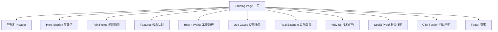
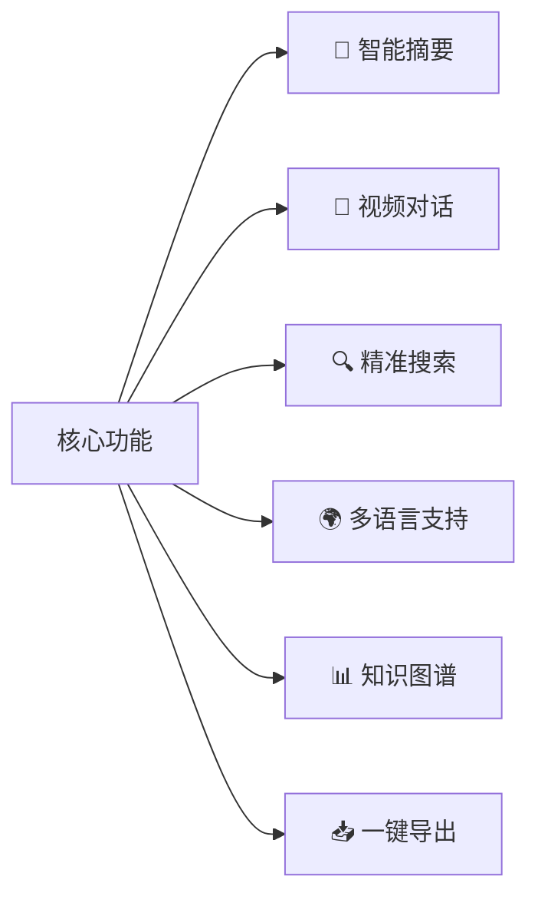
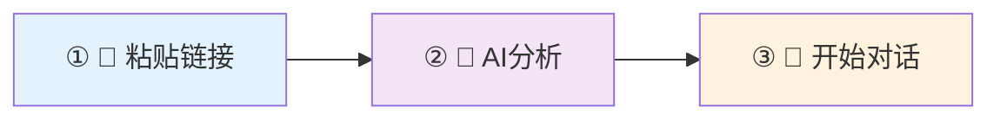
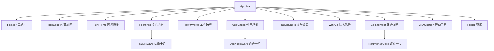
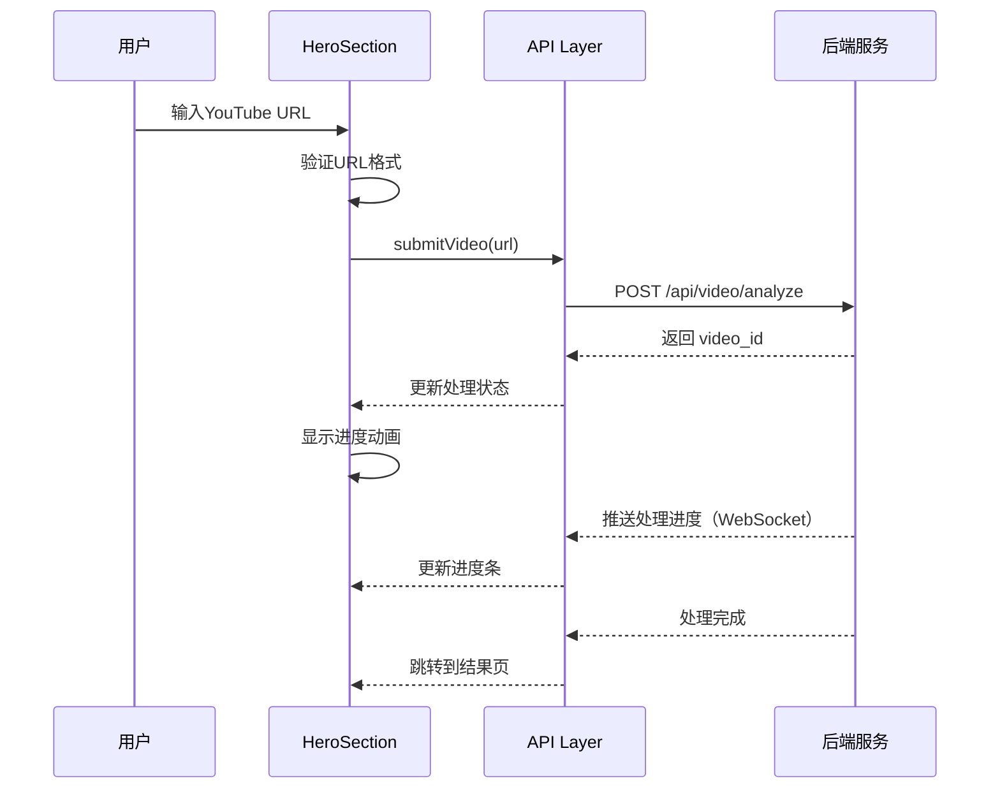
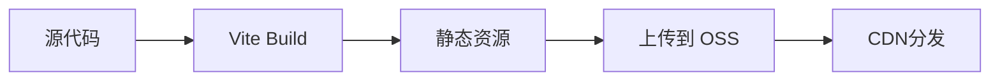

# 前端主页开发设计文档

## 概述

### 项目背景
YouTube 视频智能总结系统当前已具备完整的后端服务能力（视频处理、语音转录、AI总结），并通过 Gradio 提供基础的 Web 界面。为了提供更专业、更具营销吸引力的用户体验，需要开发一个独立的前端展示主页。

### 核心价值主张
**"Chat with Any Video, Understand Everything"** - 将任何视频变成可对话的知识库，帮助用户节省时间、不错过细节。

### 设计目标
1. **吸引力**: 通过精美的视觉设计和清晰的价值传达，快速抓住访客注意力
2. **说服力**: 通过问题共鸣、功能展示、场景代入、社会证明，逐步建立信任并促成转化
3. **体验性**: 提供即时体验入口（在 Hero 区就能输入 URL 开始体验）
4. **响应性**: 支持多设备访问（Desktop、Tablet、Mobile）
5. **性能**: 快速加载，流畅的动画效果

### 技术约束
- 框架选型：React 18+ （优先）/ Vue 3+ / Next.js
- UI 组件库：Shadcn/ui（推荐）/ Ant Design / Material Design 3 / Tailwind UI
- 动画库：Framer Motion / GSAP
- 图表库：Mermaid.js（用于可视化工作流程）
- 构建工具：Vite / Next.js
- 代码规范：TypeScript + ESLint + Prettier

## 页面架构

### 整体结构

### 导航栏设计

| 元素 | 位置 | 功能描述 |
|------|------|----------|
| Logo | 左侧 | 品牌标识，点击回到顶部 |
| 产品功能 | 中部导航 | 锚点链接：功能、场景、定价 |
| 文档链接 | 中部导航 | 链接到技术文档、API文档 |
| 登录按钮 | 右侧 | 引导已注册用户登录 |
| 免费试用按钮 | 右侧 | 主 CTA，高对比度强调色 |

**交互行为**：
- 滚动后固定在顶部（sticky）
- 滚动时背景增加半透明模糊效果
- 当前浏览区块对应导航项高亮

## 核心分屏设计

### 第一屏：Hero Section（英雄区）

#### 布局结构

| 区域 | 内容 | 视觉设计 |
|------|------|----------|
| 主标题 | "Chat with Any Video, Understand Everything" | 48px/Bold，渐变色文字效果 |
| 副标题 | 将任何视频变成可对话的知识库 不再错过视频中的任何细节和灵感 | 24px/Regular，中性色 |
| 输入框 | URL 输入或文件上传切换 | 大尺寸输入框（600px宽），圆角设计 |
| 主CTA | "🚀 免费开始分析" | 大号按钮，橙色强调色 |
| 次要CTA | "📺 观看演示(1分钟)" | 次要按钮，带播放图标 |
| 信任数据 | "已帮助 2,847 位用户节省 18,392 小时观看时间" | 小字体，灰色，数字加粗 |
| 演示动画 | 输入视频 → AI分析 → 对话界面 | 循环播放的流程动画 |

#### 交互设计
- 输入框默认显示示例 YouTube URL（打字机动画效果）
- 支持拖拽上传视频文件
- 点击"免费开始分析"后，滚动到工作流程区或直接跳转到 Gradio 应用
- 演示视频支持 hover 暂停/播放

### 第二屏：Pain Points（问题场景）

#### 痛点列表

| 痛点描述 | 图标 | 目标用户 |
|---------|------|----------|
| 2小时的视频课程，只想找那5分钟的核心内容 | ⏱️ | 学习者、职场人士 |
| 看完就忘，想回顾但找不到关键时间点 | 🔍 | 内容创作者、研究人员 |
| 多语言视频听不懂，字幕翻译又不准确 | 🌍 | 国际化用户 |
| 需要引用视频内容，但无法快速定位原话 | 📝 | 研究人员、写作者 |

#### 视觉设计
- 浅灰背景（#FAFAFA）+ 红色 × 图标
- 4个痛点采用 2×2 网格布局
- 每个卡片带 hover 放大效果（scale: 1.05）
- 卡片内配插画或 icon

**过渡动画**：卡片依次从下方淡入（stagger 效果）

### 第三屏：Features（核心功能展示）

#### 功能模块定义

#### 功能卡片详细设计

| 功能 | 一句话描述 | 核心子功能 | 动画演示内容 |
|------|-----------|-----------|-------------|
| 🎯 智能摘要 | 一键生成多层次摘要 | • 3秒概览 • 章节拆解 • 关键帧提取 | Hover 显示摘要生成过程 GIF |
| 💬 视频对话 | 像和朋友聊天一样提问视频 | • 多轮对话 • 上下文理解 • 追问深挖 | 对话界面交互演示 |
| 🔍 精准搜索 | 找到视频中任何细节 | • 语义搜索 • 时间戳定位 • 引用原文 | 搜索 → 跳转到时间点 |
| 🌍 多语言支持 | 120+语言自动识别翻译 | • 自动识别 • 实时翻译 • 双语字幕 | 多语言视频处理演示 |
| 📊 知识图谱 | 可视化内容关系结构 | • 主题提取 • 关系图谱 • 知识节点 | 图谱可视化动画 |
| 📥 一键导出 | 多种格式一键分享 | • Markdown • PDF • JSON API | 导出菜单展开动画 |

#### 布局设计
- 3×2 网格布局（Desktop）
- 每个卡片：白色背景 + 圆角 + 阴影
- Hover 效果：向上浮动 8px + 阴影增强
- 图标采用渐变色

### 第四屏：How It Works（工作流程）

#### 流程步骤定义

#### 步骤详细说明

| 步骤 | 标题 | 说明文本 | 视觉元素 |
|------|------|---------|---------|
| ① | 📎 粘贴链接 | YouTube/本地视频 一键上传 | 拖拽上传动画 |
| ② | 🤖 AI分析 | 自动提取音频 智能转录字幕 生成摘要结构 | 进度条动画 |
| ③ | 💬 开始对话 | 随时提问 精准回答 深度挖掘 | 对话气泡动画 |

#### 性能指标展示
- 中心突出显示："⏱️ 平均处理时间：5分钟视频 < 30秒"
- 采用大号字体 + 醒目颜色（绿色）

**交互设计**：横向时间轴，步骤间箭头带流动动画

### 第五屏：Use Cases（使用场景）

#### 用户角色定义

| 角色 | Slogan | 核心应用场景 | 图标/插画 |
|------|--------|-------------|----------|
| 🎓 学习者 | "2小时课程，30秒抓核心" | ✓ 课程笔记生成 ✓ 知识点复习 ✓ 考前速览 | 学生插画 |
| 👨‍💼 内容创作者 | "快速提取竞品视频亮点做选题" | ✓ 灵感素材收集 ✓ 脚本参考提取 ✓ 趋势分析 | 创作者插画 |
| 📊 职场人士 | "会议录像秒变行动要点清单" | ✓ 会议纪要整理 ✓ 培训内容提炼 ✓ 演讲稿生成 | 商务人士插画 |
| 🔬 研究人员 | "文献视频批量分析不费力" | ✓ 学术视频标注 ✓ 访谈内容分析 ✓ 数据引用定位 | 研究员插画 |

#### 视觉设计
- 2×2 网格布局
- 每个卡片包含：
  - 图标（顶部）
  - 角色名称（粗体）
  - 引用语句（斜体，引号包围）
  - 应用场景列表（带勾选标记）
- 卡片背景色采用淡色渐变

### 第六屏：Real Example（实际效果展示）

#### 案例选择
- 示例视频：《斯坦福CS229机器学习第一课》
- 原因：知名度高、内容专业、时长适中（1小时42分）

#### 交互式展示设计

| 区域 | 内容 | 交互行为 |
|------|------|---------|
| 视频播放器 | 嵌入 YouTube 播放器或截图 | 可播放预览 |
| 左侧摘要面板 | 📋 课程概要 第1章 机器学习概述(0:00) 第2章 监督学习(3:15) 关键点列表 | 点击章节跳转到对应时间 |
| 右侧对话面板 | 💬 提问："什么是监督学习?" 🤖 回答：在视频3:24处，教授解释... [跳转到3:24] | 可点击"试试你自己的视频" |

#### 设计要点
- 左右分栏布局（Desktop），上下堆叠（Mobile）
- 对话面板展示 2-3 轮真实对话
- 每条回答都带有时间戳链接
- 底部设置 CTA："试试你自己的视频"

### 第七屏：Why Us（技术优势）

#### 优势矩阵

| 维度 | 标题 | 要点列表 |
|------|------|---------|
| 🚀 极速 | 极速处理 | • 30秒处理5分钟视频 • 支持4K高清 • 批量处理能力 |
| 🎯 精准 | 精准理解 | • 多模态AI理解 • 上下文不丢失 • 120+语言支持 |
| 🔒 安全 | 安全可靠 | • 隐私优先设计 • 本地处理选项 • 数据加密存储 |
| 💰 性价比 | 性价比高 | • 免费额度慷慨 • 按需付费 • 无隐藏费用 |
| 🔄 灵活 | 灵活集成 | • 支持多种视频源 • API接入支持 • Webhook 通知 |
| 🌟 可靠 | 稳定可靠 | • 99.9%可用性 • 24/7技术支持 • SLA 保障 |

#### 布局设计
- 3×2 网格布局
- 每个卡片居中对齐
- 图标 + 标题 + 要点列表
- 简洁的 icon 设计

### 第八屏：Social Proof（社会证明）

#### 评价数据
- 总评分：⭐⭐⭐⭐⭐ 4.9/5.0
- 评价数量：1,234 条
- 展示形式：星级 + 数字 + 评价卡片轮播

#### 用户评价卡片

| 用户 | 角色 | 评价内容 |
|------|------|---------|
| 张同学 | 产品经理 | "终于不用看2小时废话了，直接定位到我需要的部分，节省了大量时间！" |
| 李经理 | 创业者 | "会议录音秒变行动清单，团队协作效率提升明显。" |
| 王研究员 | 博士生 | "学习效率提升3倍，文献视频分析从此不再痛苦。" |

#### 视觉设计
- 卡片轮播（Carousel）设计
- 每个卡片包含：头像、姓名、角色、评价内容
- 支持左右切换按钮
- 自动轮播（5秒/张）

### 第九屏：CTA Section（最终行动号召）

#### 核心元素

| 元素 | 内容 | 视觉设计 |
|------|------|---------|
| 主标题 | 🎯 准备好让视频为你所用了吗？ | 36px/Bold，居中 |
| 副标题 | 从你的第一个视频开始改变学习方式 | 18px/Regular |
| 输入框 | 粘贴YouTube链接开始体验... | 大号输入框，600px宽 |
| 主CTA | 🚀 免费开始使用 | 大号按钮，橙色 |
| 次要CTA | 📞 联系我们 | 次要按钮 |
| 信任标记 | ✓ 无需信用卡  ✓ 每月10个免费视频  ✓ 随时取消 | 小字体，灰色 |

#### 背景设计
- 渐变背景（#6366F1 → #8B5CF6）
- 白色文字
- 适当的内边距（80px上下）

## 视觉设计规范

### 配色方案

#### 主色系

| 颜色名称 | Hex 值 | 应用场景 |
|---------|--------|---------|
| 主品牌色（靛蓝紫） | #6366F1 | Logo、主导航、图标 |
| 辅助色（翠绿） | #10B981 | 成功状态、完成图标 |
| 强调色（橙色） | #F59E0B | CTA按钮、重要提示 |

#### 功能色

| 颜色名称 | Hex 值 | 应用场景 |
|---------|--------|---------|
| 视频相关（粉紫） | #EC4899 | 视频图标、视频相关功能 |
| 文本摘要（蓝色） | #3B82F6 | 文档图标、摘要功能 |
| 对话功能（紫色） | #8B5CF6 | 对话图标、聊天界面 |

#### 中性色

| 颜色名称 | Hex 值 | 应用场景 |
|---------|--------|---------|
| 背景色 | #FAFAFA | 页面背景 |
| 卡片背景 | #FFFFFF | 卡片、面板 |
| 主要文字 | #1F2937 | 标题、正文 |
| 次要文字 | #6B7280 | 辅助说明、标签 |

### 字体系统

#### 标题层级

| 层级 | 字号/粗细 | 应用场景 |
|------|----------|---------|
| H1 | 48px/Bold | 英雄区主标题 |
| H2 | 36px/Bold | 区块标题 |
| H3 | 24px/Semibold | 卡片标题 |
| H4 | 18px/Medium | 小标题 |

#### 正文字体

| 类型 | 字号/粗细 | 应用场景 |
|------|----------|---------|
| Body | 16px/Regular | 主要内容 |
| Small | 14px/Regular | 辅助说明 |

#### 字体推荐
- 英文：Inter / Poppins
- 中文：PingFang SC / 思源黑体

### 动画效果规范

#### 基础动画

| 动画类型 | 参数设置 | 应用场景 |
|---------|---------|---------|
| 淡入 | opacity: 0 → 1, duration: 0.3s | 元素进入 |
| 向上滑入 | translateY: 20px → 0, duration: 0.4s | 卡片进入 |
| Hover 浮动 | translateY: 0 → -8px, duration: 0.2s | 卡片悬停 |
| 阴影增强 | shadow: sm → lg, duration: 0.2s | 卡片悬停 |

#### 特殊动画

| 元素 | 动画效果 | 实现方式 |
|------|---------|---------|
| Hero 区输入框 | 光标闪烁 + 打字机效果 | CSS animation + JS |
| 功能卡片 | Hover 时图标旋转/缩放 | CSS transform |
| 工作流程箭头 | 流动动画 | CSS animation（dash offset） |
| 滚动触发 | 进入视口时淡入 | Intersection Observer API |

### 响应式设计规范

#### 断点定义

| 设备 | 屏幕宽度 | 布局调整 |
|------|---------|---------|
| Mobile | < 768px | 单列布局，隐藏部分装饰元素 |
| Tablet | 768px - 1024px | 双列布局，调整字体大小 |
| Desktop | > 1024px | 完整布局，所有效果 |

#### 移动端优化策略
- 导航栏折叠为汉堡菜单
- 功能卡片堆叠为单列
- 图片采用响应式加载（srcset）
- 动画效果简化或禁用

## 组件架构

### 页面组件树

### 核心组件定义

#### 1. Header（导航栏组件）

**职责**：提供全局导航和主要行动入口

| 属性 | 类型 | 说明 |
|------|------|------|
| isScrolled | boolean | 是否处于滚动状态（改变背景样式） |
| activeSection | string | 当前激活的区块（高亮导航项） |

**方法**：
- `handleScroll()`: 监听滚动事件，更新状态
- `scrollToSection(sectionId)`: 平滑滚动到指定区块

#### 2. HeroSection（英雄区组件）

**职责**：吸引访客注意力，提供即时体验入口

| 属性 | 类型 | 说明 |
|------|------|------|
| inputValue | string | URL输入框内容 |
| inputMode | 'url' \| 'file' | 输入模式 |
| isProcessing | boolean | 是否正在处理 |

**方法**：
- `handleSubmit()`: 提交视频URL或文件
- `toggleInputMode()`: 切换输入模式
- `handleFileUpload(file)`: 处理文件上传

#### 3. FeatureCard（功能卡片组件）

**职责**：展示单个核心功能

| 属性 | 类型 | 说明 |
|------|------|------|
| icon | ReactNode | 功能图标 |
| title | string | 功能标题 |
| description | string | 一句话描述 |
| features | string[] | 核心子功能列表 |
| demoUrl | string | 动画演示链接 |

**交互**：
- Hover 显示动画演示
- 点击展开更多详情（可选）

#### 4. TestimonialCard（评价卡片组件）

**职责**：展示用户评价

| 属性 | 类型 | 说明 |
|------|------|------|
| userName | string | 用户姓名 |
| userRole | string | 用户角色 |
| userAvatar | string | 用户头像URL |
| content | string | 评价内容 |
| rating | number | 评分（1-5） |

### 状态管理策略

#### 全局状态（可选使用 Context API 或 Zustand）

| 状态名 | 类型 | 用途 |
|--------|------|------|
| currentSection | string | 当前浏览的区块 |
| isVideoProcessing | boolean | 视频是否正在处理 |
| userInteraction | object | 用户交互记录（分析用） |

#### 本地状态（组件内部）
- 表单输入值
- 动画播放状态
- 展开/折叠状态

## 数据流设计

### 视频提交流程

### API 集成设计

#### 后端接口依赖

| 接口路径 | 方法 | 用途 | 对应后端服务 |
|---------|------|------|-------------|
| `/api/video/analyze` | POST | 提交视频分析任务 | pipeline_service.py |
| `/api/video/{video_id}` | GET | 获取处理结果 | 查询元数据 |
| `/api/video/{video_id}/chat` | POST | 与视频对话 | 未实现（需新增） |
| `/api/stats` | GET | 获取统计数据（用户数、时长等） | 未实现（需新增） |

#### 数据模型

**提交请求**：
| 字段 | 类型 | 必填 | 说明 |
|------|------|------|------|
| video_source | 'youtube' \| 'upload' | 是 | 视频来源 |
| youtube_url | string | 条件 | YouTube URL（source=youtube时必填） |
| file | File | 条件 | 上传文件（source=upload时必填） |
| language | string | 否 | 语言选择（默认auto） |
| granularity | 'brief' \| 'standard' \| 'detailed' | 否 | 总结粒度 |

**处理结果**：
| 字段 | 类型 | 说明 |
|------|------|------|
| video_id | string | 视频ID |
| status | string | 处理状态 |
| metadata | VideoMetadata | 视频元数据 |
| summary | VideoSummary | 总结内容 |
| keyframes | Keyframe[] | 关键帧列表 |
| transcript | Transcript | 转录文本 |

## 性能优化策略

### 加载优化

| 策略 | 实现方式 | 目标 |
|------|---------|------|
| 代码分割 | React.lazy + Suspense | 首屏加载 < 2s |
| 图片懒加载 | Intersection Observer | 减少初始请求 |
| 字体优化 | font-display: swap | 避免字体阻塞渲染 |
| 资源预加载 | `<link rel="preload">` | 关键资源优先加载 |

### 运行时优化

| 策略 | 实现方式 | 目标 |
|------|---------|------|
| 虚拟滚动 | react-window | 长列表性能 |
| 防抖节流 | lodash.debounce | 减少事件触发 |
| 图片优化 | WebP格式 + 响应式 | 减少带宽消耗 |
| 动画优化 | transform + opacity | 避免重排重绘 |

### 缓存策略

| 资源类型 | 缓存策略 | 有效期 |
|---------|---------|--------|
| 静态资源（JS/CSS） | 强缓存 + hash命名 | 1年 |
| 图片资源 | CDN缓存 | 1个月 |
| API响应 | SWR策略 | 5分钟 |

## 部署架构

### 构建流程

### 部署方案选型

| 方案 | 优势 | 适用场景 |
|------|------|---------|
| Vercel | 自动化部署、全球CDN | 快速原型验证 |
| 阿里云 OSS + CDN | 成本低、国内访问快 | 正式生产环境 |
| Nginx 静态托管 | 完全控制 | 自有服务器部署 |

### 环境变量配置

| 变量名 | 说明 | 示例值 |
|--------|------|--------|
| VITE_API_BASE_URL | 后端API地址 | https://api.example.com |
| VITE_GRADIO_URL | Gradio应用地址 | https://gradio.example.com |
| VITE_CDN_URL | CDN资源地址 | https://cdn.example.com |

## 测试策略

### 测试类型

| 测试类型 | 工具 | 覆盖范围 |
|---------|------|---------|
| 单元测试 | Vitest + React Testing Library | 组件逻辑、工具函数 |
| 集成测试 | Cypress / Playwright | 关键用户流程 |
| 视觉回归测试 | Percy / Chromatic | UI一致性 |
| 性能测试 | Lighthouse CI | 加载性能、可访问性 |

### 关键测试用例

| 用例 | 测试内容 | 预期结果 |
|------|---------|---------|
| Hero区提交 | 输入YouTube URL并提交 | 跳转到处理页或显示进度 |
| 功能卡片 | Hover功能卡片 | 显示动画演示 |
| 导航栏滚动 | 滚动页面 | 导航栏固定且样式改变 |
| 响应式布局 | 切换不同设备尺寸 | 布局正确适配 |
| 评价轮播 | 点击左右切换按钮 | 评价卡片切换 |

## 可访问性（A11y）设计

### WCAG 2.1 遵循

| 原则 | 实施措施 |
|------|---------|
| 可感知性 | • 所有图片提供 alt 属性 • 视频提供字幕 • 颜色对比度 ≥ 4.5:1 |
| 可操作性 | • 所有功能支持键盘访问 • 焦点指示器明显 • 不使用纯闪烁动画 |
| 可理解性 | • 清晰的错误提示 • 一致的导航结构 • 表单标签明确 |
| 健壮性 | • 语义化 HTML • ARIA 标签适当使用 • 浏览器兼容性测试 |

### 键盘导航设计

| 按键 | 功能 |
|------|------|
| Tab | 焦点移至下一个可交互元素 |
| Shift+Tab | 焦点移至上一个可交互元素 |
| Enter | 激活按钮或链接 |
| Esc | 关闭弹窗或取消操作 |
| 方向键 | 轮播图切换（可选） |

## SEO 优化策略

### 元数据配置

| 标签 | 内容 | 作用 |
|------|------|------|
| `<title>` | YouTube 视频智能总结 - Chat with Any Video | 页面标题 |
| `<meta name="description">` | 将任何视频变成可对话的知识库，支持YouTube下载、AI摘要、语音转录 | 搜索引擎描述 |
| `<meta name="keywords">` | YouTube摘要,视频总结,AI视频分析,语音转录 | 关键词 |
| Open Graph | og:title, og:description, og:image | 社交媒体分享 |
| Twitter Card | twitter:card, twitter:title, twitter:description | Twitter分享 |

### 结构化数据（Schema.org）

**SoftwareApplication Schema**：
| 属性 | 值 |
|------|-----|
| @type | SoftwareApplication |
| name | YouTube 视频智能总结系统 |
| applicationCategory | MultimediaApplication |
| offers.price | 0（免费试用） |
| aggregateRating | 4.9/5.0 |

### 内容优化
- H1 标签唯一且包含核心关键词
- 图片使用描述性文件名（如 `video-analysis-demo.png`）
- URL 结构清晰（如 `/features`, `/pricing`）
- 页面加载速度优化（Lighthouse 评分 > 90）

## 分析与追踪

### 关键指标（KPIs）

| 指标 | 工具 | 目标值 |
|------|------|--------|
| 页面加载时间 | Google Analytics | < 2s |
| 跳出率 | GA | < 40% |
| 转化率（提交视频） | GA Events | > 5% |
| 滚动深度 | GA | 80%用户到达第三屏 |
| CTA点击率 | GA Events | > 10% |

### 埋点事件设计

| 事件名 | 触发时机 | 参数 |
|--------|---------|------|
| page_view | 页面加载 | page_path, referrer |
| hero_cta_click | 点击Hero区CTA | button_text, input_value |
| feature_card_hover | Hover功能卡片 | feature_name |
| video_submit | 提交视频 | source_type, url |
| scroll_depth | 滚动到特定深度 | depth_percentage |

## 未来扩展方向

### Phase 2: Chat with Video 功能完整实现

**新增页面**：
- `/chat/{video_id}`: 视频对话界面
- `/dashboard`: 用户个人中心
- `/history`: 处理历史记录

**交互设计**：
| 元素 | 功能描述 |
|------|---------|
| 对话输入框 | 支持文本输入 + 语音输入 |
| 智能提示 | 根据视频内容推荐问题 |
| 时间轴跳转 | 点击回答中的时间戳跳转到视频 |
| 对话历史 | 保存历史对话记录 |
| 分享功能 | 生成对话链接分享 |

### Phase 3: 知识图谱可视化

**技术选型**：
- D3.js / ECharts / Cytoscape.js

**可视化内容**：
- 视频主题节点
- 概念关系连线
- 时间线轴
- 交互式探索

### Phase 4: 协作功能

**功能规划**：
- 团队工作空间
- 视频标注协作
- 评论与讨论
- 权限管理

## 风险与挑战

### 技术风险

| 风险 | 影响 | 缓解措施 |
|------|------|---------|
| 后端API未完全就绪 | 前端无法完整测试 | 使用 Mock 数据开发 |
| 视频处理时间长 | 用户等待体验差 | 提供进度反馈 + WebSocket实时更新 |
| 跨域问题 | API调用失败 | 配置CORS或使用代理 |

### 用户体验风险

| 风险 | 影响 | 缓解措施 |
|------|------|---------|
| 动画过多影响性能 | 低端设备卡顿 | 检测设备性能，降级动画 |
| 首屏加载慢 | 高跳出率 | 代码分割、资源优化 |
| 移动端体验不佳 | 移动用户流失 | 响应式设计 + 移动优先 |

## 交付物清单

### 设计阶段
- [ ] 完整设计稿（Figma/Sketch）
- [ ] 交互原型（可点击）
- [ ] 设计规范文档
- [ ] 动画效果演示视频

### 开发阶段
- [ ] 项目脚手架搭建
- [ ] 组件库开发（Storybook）
- [ ] 页面组装与联调
- [ ] 单元测试 + 集成测试
- [ ] 性能优化报告

### 部署阶段
- [ ] 构建产物
- [ ] 部署脚本
- [ ] 环境配置文档
- [ ] 监控与分析配置

---

**设计文档版本**: v1.0  
**最后更新**: 2024  
**负责人**: Frontend Team
