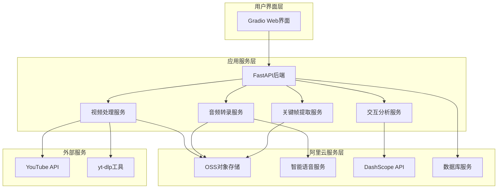
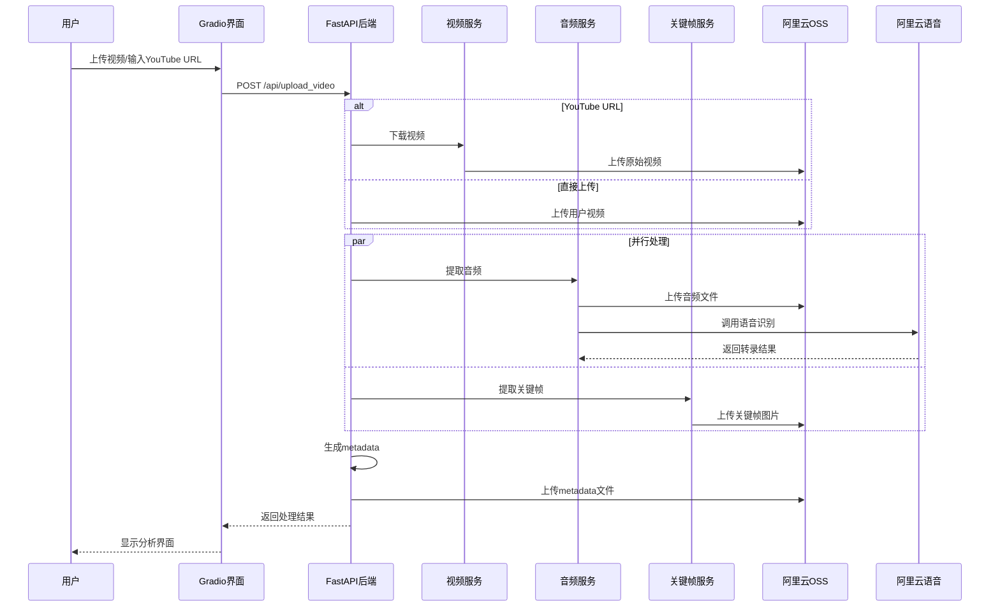
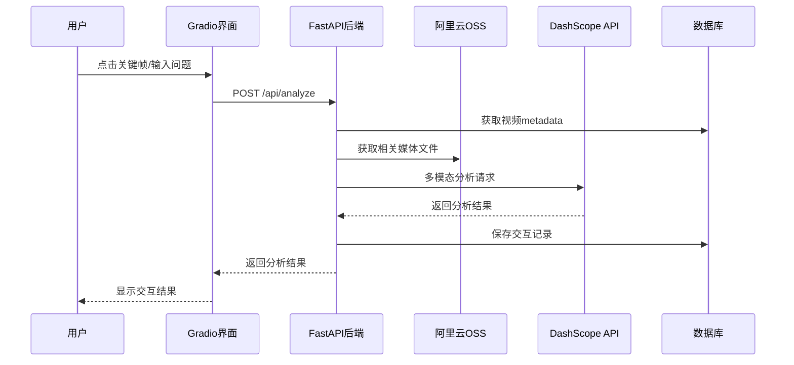

# 阿里云视频分析平台技术设计文档

## 1. 项目概述

### 1.1 项目背景
基于现有YouTube Summarizer项目，设计并实现一个云原生的视频分析平台，支持多模态交互和智能内容分析。

### 1.2 核心功能
- **双输入源支持**：用户上传视频文件 + YouTube URL下载
- **并行音视频处理**：同时进行音频转录和关键帧提取
- **智能场景检测**：基于ffmpeg的场景变化检测算法提取关键帧
- **云存储集成**：所有媒体文件存储在阿里云OSS
- **多模态交互**：基于关键帧和转录内容的智能问答
- **时间轴导航**：关键帧与时间戳的精确关联

### 1.3 技术特性
- 阿里云原生架构（OSS、智能语音服务、DashScope）
- 最多10帧的精确关键帧提取
- 段落级时间戳的音频转录
- Gradio交互界面
- 逐步上传的容错处理机制

## 2. 技术架构设计

### 2.1 整体架构图



### 2.2 核心技术栈

| 组件类型 | 技术选择 | 说明 |
|---------|---------|------|
| 前端界面 | Gradio | 保持现有界面，支持快速原型开发 |
| 后端API | FastAPI | 异步处理，高性能API服务 |
| 视频处理 | ffmpeg | 音频提取和关键帧检测 |
| 音频转录 | 阿里云智能语音服务 | 录音文件识别，段落级时间戳 |
| 视频下载 | yt-dlp | YouTube视频下载 |
| 云存储 | 阿里云OSS | 统一媒体文件存储 |
| 多模态AI | DashScope API | 智能交互分析 |
| 数据库 | ApsaraDB/本地SQLite | 元数据存储 |

## 3. 数据流设计

### 3.1 视频处理主流程



### 3.2 交互分析流程



## 4. 核心服务模块设计

### 4.1 视频处理服务

```python
class VideoProcessingService:
    """视频处理核心服务"""
    
    def __init__(self):
        self.oss_client = OSSClient()
        self.ffmpeg_processor = FFmpegProcessor()
        
    async def process_video_dual_source(self, 
                                      video_file: Optional[UploadFile] = None,
                                      youtube_url: Optional[str] = None) -> ProcessingResult:
        """
        双输入源视频处理
        
        Args:
            video_file: 用户上传的视频文件
            youtube_url: YouTube视频URL
            
        Returns:
            处理结果包含OSS URL和基础信息
        """
        video_id = self._generate_video_id()
        
        # 步骤1: 获取视频文件
        if youtube_url:
            video_path = await self._download_from_youtube(youtube_url)
        elif video_file:
            video_path = await self._save_uploaded_file(video_file)
        else:
            raise ValueError("必须提供视频文件或YouTube URL")
            
        # 步骤2: 上传原始视频到OSS
        video_oss_url = await self.oss_client.upload_video(video_path, video_id)
        
        # 步骤3: 启动并行处理
        audio_task = asyncio.create_task(
            self._extract_and_process_audio(video_path, video_id)
        )
        keyframes_task = asyncio.create_task(
            self._extract_keyframes(video_path, video_id)
        )
        
        # 等待并行任务完成
        audio_result, keyframes_result = await asyncio.gather(
            audio_task, keyframes_task
        )
        
        # 步骤4: 生成并上传metadata
        metadata = await self._generate_metadata(
            video_id, video_oss_url, audio_result, keyframes_result
        )
        
        return ProcessingResult(
            video_id=video_id,
            metadata=metadata,
            status="success"
        )
```

### 4.2 音频转录服务

```python
class AudioTranscriptionService:
    """阿里云语音识别服务"""
    
    def __init__(self):
        self.asr_client = AlibabaASRClient()
        self.oss_client = OSSClient()
        
    async def extract_and_transcribe_audio(self, video_path: str, video_id: str) -> TranscriptionResult:
        """
        提取音频并进行转录
        
        Args:
            video_path: 视频文件路径
            video_id: 视频唯一标识
            
        Returns:
            转录结果，包含段落级时间戳
        """
        # 使用ffmpeg提取音频
        audio_path = await self._extract_audio_with_ffmpeg(video_path)
        
        # 上传音频到OSS
        audio_oss_url = await self.oss_client.upload_audio(audio_path, video_id)
        
        # 调用阿里云录音文件识别
        transcription = await self.asr_client.transcribe_file(
            audio_oss_url,
            timestamp_level="paragraph"  # 段落级时间戳
        )
        
        return TranscriptionResult(
            audio_oss_url=audio_oss_url,
            segments=transcription.segments,
            language=transcription.language,
            confidence=transcription.confidence
        )
    
    async def _extract_audio_with_ffmpeg(self, video_path: str) -> str:
        """使用ffmpeg提取音频"""
        audio_path = video_path.replace('.mp4', '.mp3')
        cmd = [
            'ffmpeg', '-i', video_path,
            '-q:a', '0', '-map', 'a',
            audio_path, '-y'
        ]
        
        process = await asyncio.create_subprocess_exec(*cmd)
        await process.wait()
        
        return audio_path
```

### 4.3 关键帧提取服务

```python
class KeyframeExtractionService:
    """场景变化检测的关键帧提取服务"""
    
    def __init__(self):
        self.oss_client = OSSClient()
        self.max_frames = 10  # 最多10帧
        
    async def extract_keyframes_scene_detection(self, video_path: str, video_id: str) -> List[KeyframeInfo]:
        """
        基于场景变化检测提取关键帧
        
        Args:
            video_path: 视频文件路径
            video_id: 视频唯一标识
            
        Returns:
            关键帧信息列表，最多10帧
        """
        # 使用ffmpeg进行场景检测
        scene_timestamps = await self._detect_scenes_with_ffmpeg(video_path)
        
        # 限制最多10个场景
        selected_scenes = scene_timestamps[:self.max_frames]
        
        keyframes = []
        for i, timestamp in enumerate(selected_scenes):
            # 提取特定时间戳的帧
            frame_path = await self._extract_frame_at_timestamp(video_path, timestamp, i)
            
            # 上传帧到OSS
            frame_oss_url = await self.oss_client.upload_frame(frame_path, video_id, i)
            
            keyframes.append(KeyframeInfo(
                frame_id=i + 1,
                timestamp=timestamp,
                oss_image_url=frame_oss_url,
                scene_description=f"场景{i + 1}"
            ))
            
        return keyframes
    
    async def _detect_scenes_with_ffmpeg(self, video_path: str) -> List[float]:
        """使用ffmpeg检测场景变化"""
        cmd = [
            'ffmpeg', '-i', video_path,
            '-filter:v', 'select="gt(scene,0.3)"',
            '-f', 'null', '-',
            '-v', 'info'
        ]
        
        process = await asyncio.create_subprocess_exec(
            *cmd, stdout=asyncio.subprocess.PIPE, stderr=asyncio.subprocess.PIPE
        )
        
        stdout, stderr = await process.communicate()
        
        # 解析ffmpeg输出获取场景变化时间戳
        timestamps = self._parse_scene_timestamps(stderr.decode())
        
        return sorted(timestamps)
    
    async def _extract_frame_at_timestamp(self, video_path: str, timestamp: float, frame_index: int) -> str:
        """在指定时间戳提取帧"""
        frame_path = f"/tmp/frame_{frame_index}_{timestamp:.2f}.jpg"
        
        cmd = [
            'ffmpeg', '-ss', str(timestamp),
            '-i', video_path,
            '-vframes', '1',
            '-q:v', '2',
            frame_path, '-y'
        ]
        
        process = await asyncio.create_subprocess_exec(*cmd)
        await process.wait()
        
        return frame_path
```

## 5. 数据模型设计

### 5.1 Metadata数据结构

```python
from pydantic import BaseModel
from typing import List, Optional
from datetime import datetime

class VideoInfo(BaseModel):
    """视频基础信息"""
    video_id: str
    title: Optional[str] = None
    duration: float
    oss_video_url: str
    upload_time: datetime
    source_type: str  # "upload" 或 "youtube"
    original_url: Optional[str] = None

class KeyframeInfo(BaseModel):
    """关键帧信息"""
    frame_id: int
    timestamp: float
    oss_image_url: str
    scene_description: str

class TranscriptSegment(BaseModel):
    """转录段落"""
    text: str
    start_time: float
    end_time: float
    confidence: float

class TranscriptInfo(BaseModel):
    """音频转录信息"""
    oss_audio_url: str
    language: str
    segments: List[TranscriptSegment]

class VideoMetadata(BaseModel):
    """完整的视频元数据"""
    video_info: VideoInfo
    keyframes: List[KeyframeInfo]
    transcript: TranscriptInfo
    processing_status: str
    created_at: datetime
    updated_at: datetime
```

### 5.2 数据库表设计

```sql
-- 视频记录表
CREATE TABLE videos (
    id VARCHAR(50) PRIMARY KEY,
    title VARCHAR(500),
    duration FLOAT,
    oss_video_url VARCHAR(1000),
    source_type VARCHAR(20),
    original_url VARCHAR(1000),
    processing_status VARCHAR(50),
    metadata_oss_url VARCHAR(1000),
    created_at TIMESTAMP DEFAULT CURRENT_TIMESTAMP,
    updated_at TIMESTAMP DEFAULT CURRENT_TIMESTAMP ON UPDATE CURRENT_TIMESTAMP
);

-- 交互记录表
CREATE TABLE interactions (
    id VARCHAR(50) PRIMARY KEY,
    video_id VARCHAR(50),
    interaction_type VARCHAR(50), -- 'frame_click', 'text_query', 'timeline_nav'
    user_input TEXT,
    ai_response TEXT,
    frame_id INT,
    timestamp FLOAT,
    created_at TIMESTAMP DEFAULT CURRENT_TIMESTAMP,
    FOREIGN KEY (video_id) REFERENCES videos(id)
);
```

## 6. API接口设计

### 6.1 视频处理接口

```python
from fastapi import FastAPI, UploadFile, File
from typing import Optional

app = FastAPI()

@app.post("/api/v1/videos/process")
async def process_video(
    video_file: Optional[UploadFile] = File(None),
    youtube_url: Optional[str] = None
) -> ProcessingResponse:
    """
    处理视频（双输入源支持）
    
    Args:
        video_file: 上传的视频文件（可选）
        youtube_url: YouTube视频URL（可选）
        
    Returns:
        处理状态和视频ID
    """
    pass

@app.get("/api/v1/videos/{video_id}/metadata")
async def get_video_metadata(video_id: str) -> VideoMetadata:
    """获取视频完整元数据"""
    pass

@app.get("/api/v1/videos/{video_id}/status")
async def get_processing_status(video_id: str) -> ProcessingStatus:
    """获取视频处理状态"""
    pass
```

### 6.2 交互分析接口

```python
@app.post("/api/v1/videos/{video_id}/analyze")
async def analyze_video_content(
    video_id: str,
    query: str,
    frame_id: Optional[int] = None,
    timestamp: Optional[float] = None
) -> AnalysisResponse:
    """
    多模态内容分析
    
    Args:
        video_id: 视频ID
        query: 用户查询
        frame_id: 指定关键帧ID（可选）
        timestamp: 指定时间戳（可选）
        
    Returns:
        AI分析结果
    """
    pass

@app.get("/api/v1/videos/{video_id}/timeline")
async def get_video_timeline(video_id: str) -> TimelineResponse:
    """获取视频时间轴信息（关键帧+转录段落）"""
    pass

@app.post("/api/v1/videos/{video_id}/search")
async def search_in_transcript(
    video_id: str,
    keyword: str
) -> SearchResponse:
    """在转录文本中搜索关键词"""
    pass
```

## 7. Gradio界面设计

### 7.1 界面布局

```python
import gradio as gr

def create_video_analysis_interface():
    """创建视频分析Gradio界面"""
    
    with gr.Blocks(title="阿里云视频分析平台") as interface:
        
        # 第一个Tab：视频上传/处理
        with gr.Tab("视频处理"):
            with gr.Row():
                with gr.Column(scale=1):
                    # 双输入源选择
                    input_type = gr.Radio(
                        choices=["上传视频", "YouTube URL"],
                        value="上传视频",
                        label="视频来源"
                    )
                    
                    # 视频文件上传
                    video_upload = gr.File(
                        file_types=["mp4", "avi", "mov", "mkv"],
                        label="上传视频文件",
                        visible=True
                    )
                    
                    # YouTube URL输入
                    youtube_url = gr.Textbox(
                        label="YouTube视频URL",
                        placeholder="https://www.youtube.com/watch?v=...",
                        visible=False
                    )
                    
                    # 处理按钮
                    process_btn = gr.Button("开始处理", variant="primary")
                    
                with gr.Column(scale=2):
                    # 处理状态显示
                    status_display = gr.Textbox(
                        label="处理状态",
                        interactive=False,
                        lines=3
                    )
                    
                    # 处理进度条
                    progress_bar = gr.Progress()
        
        # 第二个Tab：交互分析
        with gr.Tab("交互分析"):
            with gr.Row():
                with gr.Column(scale=1):
                    # 视频选择器
                    video_selector = gr.Dropdown(
                        label="选择已处理的视频",
                        choices=[],
                        interactive=True
                    )
                    
                    # 关键帧展示（时间轴）
                    keyframes_gallery = gr.Gallery(
                        label="关键帧时间轴（点击选择）",
                        show_label=True,
                        elem_id="keyframes_timeline",
                        columns=5,
                        rows=2,
                        height=300
                    )
                    
                with gr.Column(scale=2):
                    # 选中的关键帧显示
                    selected_frame = gr.Image(
                        label="选中的关键帧",
                        height=300
                    )
                    
                    # 对应时间段的转录文本
                    transcript_context = gr.Textbox(
                        label="对应时间段转录内容",
                        lines=4,
                        interactive=False
                    )
            
            # 用户交互区域
            with gr.Row():
                user_query = gr.Textbox(
                    label="输入您的问题",
                    placeholder="请描述您想了解的视频内容...",
                    lines=2,
                    scale=4
                )
                
                ask_btn = gr.Button(
                    "提问",
                    variant="primary",
                    scale=1
                )
            
            # AI回答展示
            ai_response = gr.Chatbot(
                label="AI分析结果",
                height=400
            )
        
        # 第三个Tab：内容搜索
        with gr.Tab("内容搜索"):
            with gr.Column():
                search_input = gr.Textbox(
                    label="搜索转录内容",
                    placeholder="输入关键词搜索...",
                    lines=1
                )
                
                search_btn = gr.Button("搜索")
                
                search_results = gr.JSON(
                    label="搜索结果",
                    visible=True
                )
    
    return interface
```

### 7.2 交互逻辑设计

```python
def setup_interface_handlers():
    """设置界面交互处理逻辑"""
    
    def on_input_type_change(input_type):
        """输入类型切换处理"""
        if input_type == "上传视频":
            return gr.update(visible=True), gr.update(visible=False)
        else:
            return gr.update(visible=False), gr.update(visible=True)
    
    def on_process_video(video_file, youtube_url, input_type):
        """视频处理处理"""
        try:
            if input_type == "上传视频" and video_file:
                result = api_client.process_uploaded_video(video_file)
            elif input_type == "YouTube URL" and youtube_url:
                result = api_client.process_youtube_video(youtube_url)
            else:
                return "请提供有效的视频文件或YouTube URL"
            
            return f"处理成功！视频ID: {result.video_id}"
        except Exception as e:
            return f"处理失败: {str(e)}"
    
    def on_keyframe_select(selected_frame_index, video_id):
        """关键帧选择处理"""
        metadata = api_client.get_video_metadata(video_id)
        selected_keyframe = metadata.keyframes[selected_frame_index]
        
        # 获取对应时间段的转录内容
        transcript_text = get_transcript_at_timestamp(
            metadata.transcript, 
            selected_keyframe.timestamp
        )
        
        return selected_keyframe.oss_image_url, transcript_text
    
    def on_ask_question(question, video_id, selected_frame_id):
        """用户提问处理"""
        response = api_client.analyze_content(
            video_id=video_id,
            query=question,
            frame_id=selected_frame_id
        )
        
        return response.ai_response
```

## 8. 部署和测试策略

### 8.1 本地开发环境

```bash
# 环境依赖
pip install fastapi uvicorn gradio
pip install alibabacloud-oss2 alibabacloud-nls20180816
pip install opencv-python ffmpeg-python asyncio

# 启动开发服务
uvicorn main:app --reload --host 0.0.0.0 --port 8000
```

### 8.2 阿里云部署

```yaml
# Docker部署配置
FROM python:3.9-slim

# 安装ffmpeg
RUN apt-get update && apt-get install -y ffmpeg

# 安装Python依赖
COPY requirements.txt .
RUN pip install -r requirements.txt

# 复制应用代码
COPY . /app
WORKDIR /app

# 启动应用
CMD ["uvicorn", "main:app", "--host", "0.0.0.0", "--port", "8000"]
```

### 8.3 测试用例设计

```python
import pytest

class TestVideoProcessing:
    """视频处理模块测试"""
    
    async def test_youtube_video_processing(self):
        """测试YouTube视频处理"""
        result = await video_service.process_video_dual_source(
            youtube_url="https://www.youtube.com/watch?v=test"
        )
        
        assert result.status == "success"
        assert len(result.metadata.keyframes) <= 10
        assert result.metadata.transcript.segments is not None
    
    async def test_keyframe_scene_detection(self):
        """测试场景检测关键帧提取"""
        keyframes = await keyframe_service.extract_keyframes_scene_detection(
            video_path="/tmp/test_video.mp4",
            video_id="test_001"
        )
        
        assert len(keyframes) <= 10
        assert all(kf.timestamp >= 0 for kf in keyframes)
    
    async def test_audio_transcription(self):
        """测试音频转录"""
        result = await audio_service.extract_and_transcribe_audio(
            video_path="/tmp/test_video.mp4",
            video_id="test_001"
        )
        
        assert result.audio_oss_url is not None
        assert len(result.segments) > 0
        assert all(seg.start_time <= seg.end_time for seg in result.segments)
```