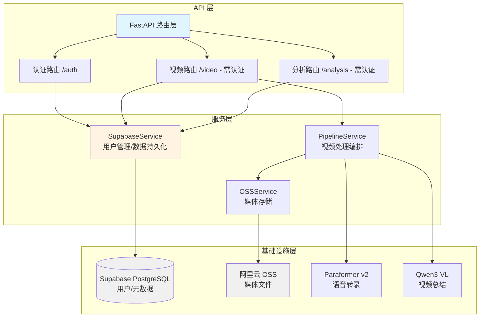
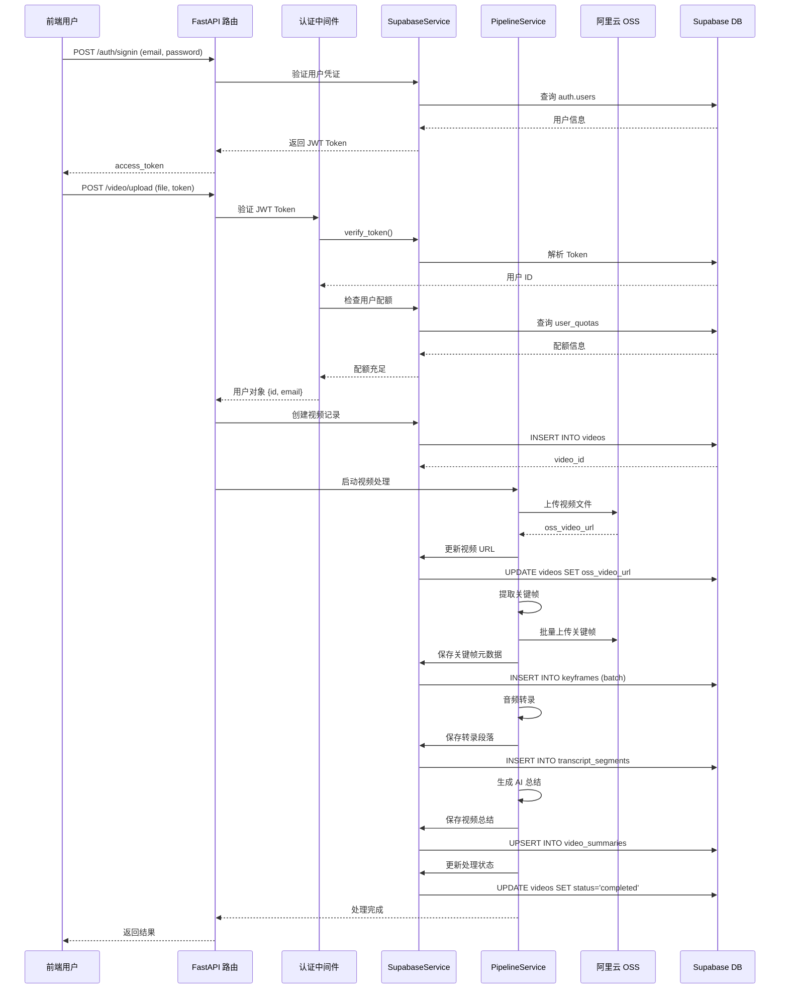
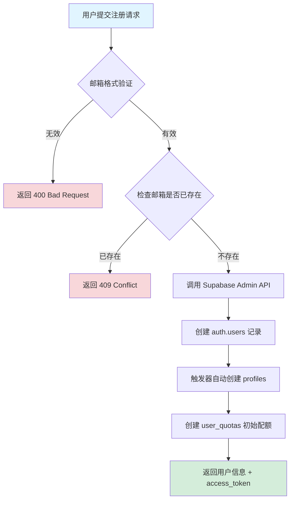
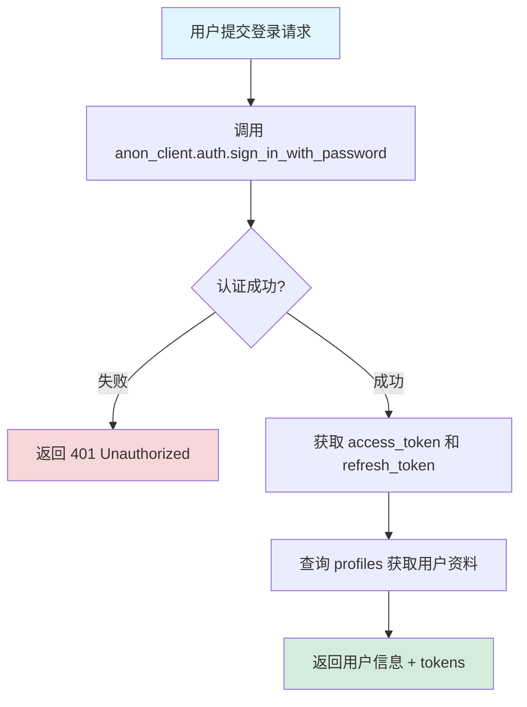
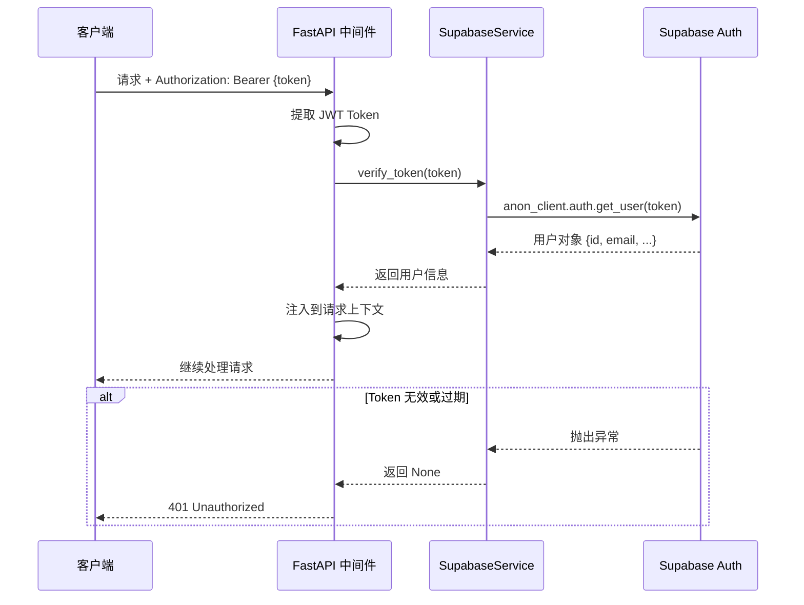
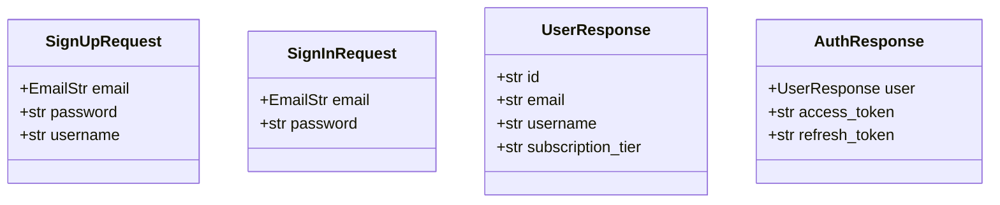
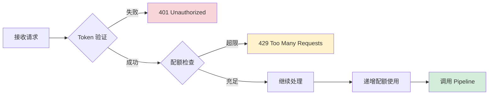
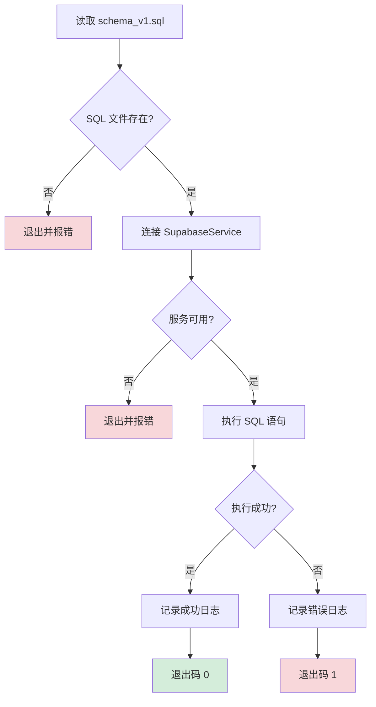

# Supabase 集成配置设计文档

## 概述

本文档定义 YouTube 视频分析系统集成 Supabase 的整体架构设计,目标是实现用户身份管理、视频元数据持久化存储、配额管理等功能,同时保持与现有阿里云服务(OSS、Paraformer-v2、Qwen3-VL-Flash)的协同工作。

### 设计目标

- 引入 Supabase 作为关系型数据库和认证服务,提供用户管理能力
- 建立视频处理数据的持久化存储机制,包括视频元数据、关键帧、转录内容、AI 总结
- 实现基于用户配额的访问控制,限制免费用户的使用量
- 保持现有阿里云 OSS 作为媒体资源存储,Supabase 仅存储元数据和 URL 引用
- 为后续前端开发提供标准 RESTful API 认证接口

### 技术边界

| 组件 | 职责范围 | 不负责 |
|------|---------|--------|
| Supabase | 用户认证、视频元数据存储、配额管理、关系数据查询 | 媒体文件存储、AI 模型调用 |
| 阿里云 OSS | 视频文件、音频文件、关键帧图片、元数据 JSON 存储 | 结构化数据查询、用户认证 |
| FastAPI | 业务逻辑编排、路由保护、服务集成 | 直接的数据库操作 |

## 架构设计

### 系统分层架构



### 数据流架构



## 数据库 Schema 设计

### 核心表结构定义

#### 1. 用户资料表 (profiles)

扩展 Supabase 内置 `auth.users` 表,存储用户业务资料。

| 字段名 | 数据类型 | 约束 | 说明 |
|--------|---------|------|------|
| id | UUID | PRIMARY KEY, FK → auth.users(id) | 用户唯一标识 |
| email | TEXT | NOT NULL | 用户邮箱(冗余,便于查询) |
| username | TEXT | UNIQUE | 用户名 |
| full_name | TEXT | | 完整姓名 |
| avatar_url | TEXT | | 头像 URL |
| subscription_tier | TEXT | DEFAULT 'free' | 订阅等级(free/pro/enterprise) |
| created_at | TIMESTAMPTZ | DEFAULT NOW() | 创建时间 |
| updated_at | TIMESTAMPTZ | DEFAULT NOW() | 更新时间 |

**业务规则**:
- `id` 与 `auth.users` 表同步,通过数据库触发器自动创建
- `subscription_tier` 决定用户配额限制
- `username` 可用于生成个性化分享链接

#### 2. 用户配额表 (user_quotas)

管理用户的月度视频处理配额和存储空间限制。

| 字段名 | 数据类型 | 约束 | 说明 |
|--------|---------|------|------|
| user_id | UUID | PRIMARY KEY, FK → profiles(id) | 用户 ID |
| monthly_video_limit | INTEGER | DEFAULT 10 | 月度视频处理上限 |
| monthly_videos_used | INTEGER | DEFAULT 0 | 本月已使用次数 |
| total_storage_mb | INTEGER | DEFAULT 1000 | 总存储空间(MB) |
| used_storage_mb | INTEGER | DEFAULT 0 | 已使用存储空间(MB) |
| reset_date | TIMESTAMPTZ | NOT NULL | 配额重置日期 |
| created_at | TIMESTAMPTZ | DEFAULT NOW() | 创建时间 |
| updated_at | TIMESTAMPTZ | DEFAULT NOW() | 更新时间 |

**业务规则**:
- 每次视频上传前检查 `monthly_videos_used < monthly_video_limit`
- 每次上传后递增 `monthly_videos_used` 和 `used_storage_mb`
- 每月自动重置 `monthly_videos_used` 为 0(通过定时任务或触发器)

#### 3. 视频信息主表 (videos)

存储视频的基本信息、处理状态和 OSS 资源链接。

| 字段名 | 数据类型 | 约束 | 说明 |
|--------|---------|------|------|
| video_id | TEXT | PRIMARY KEY | 视频唯一标识(格式: video_YYYYMMDD_HHMMSS_random) |
| user_id | UUID | NOT NULL, FK → profiles(id) | 所属用户 |
| title | TEXT | NOT NULL | 视频标题 |
| duration | FLOAT | | 视频时长(秒) |
| source_type | TEXT | CHECK IN ('upload', 'youtube') | 来源类型 |
| original_url | TEXT | | YouTube 原始 URL(仅 source_type='youtube') |
| oss_video_url | TEXT | NOT NULL | OSS 视频文件 URL |
| oss_audio_url | TEXT | | OSS 音频文件 URL |
| video_format | TEXT | | 视频格式(mp4/avi/mov) |
| video_size | BIGINT | | 文件大小(字节) |
| video_resolution | TEXT | | 分辨率(如 1920x1080) |
| processing_status | TEXT | CHECK IN ('pending', 'processing', 'completed', 'failed') | 处理状态 |
| processing_progress | INTEGER | DEFAULT 0 | 处理进度(0-100) |
| error_message | TEXT | | 错误信息(status='failed'时) |
| upload_time | TIMESTAMPTZ | DEFAULT NOW() | 上传时间 |
| processing_started_at | TIMESTAMPTZ | | 处理开始时间 |
| processing_completed_at | TIMESTAMPTZ | | 处理完成时间 |
| created_at | TIMESTAMPTZ | DEFAULT NOW() | 创建时间 |
| updated_at | TIMESTAMPTZ | DEFAULT NOW() | 更新时间 |

**索引设计**:
- `idx_videos_user_id` ON `(user_id)` - 用户视频列表查询
- `idx_videos_status` ON `(processing_status)` - 处理状态过滤

**业务规则**:
- `processing_progress` 遵循 7 个关键节点: 0%, 15%, 30%, 45%, 60%, 80%, 95%, 100%
- `processing_status` 状态流转: pending → processing → completed/failed
- 外键删除策略: `ON DELETE CASCADE`(删除用户时级联删除视频)

#### 4. 关键帧表 (keyframes)

存储视频关键帧的时间戳和 OSS 图片 URL。

| 字段名 | 数据类型 | 约束 | 说明 |
|--------|---------|------|------|
| id | BIGSERIAL | PRIMARY KEY | 自增主键 |
| video_id | TEXT | NOT NULL, FK → videos(video_id) | 所属视频 |
| frame_id | INTEGER | NOT NULL | 帧序号(从 0 开始) |
| timestamp | FLOAT | NOT NULL | 时间戳(秒) |
| oss_image_url | TEXT | NOT NULL | OSS 图片 URL |
| scene_description | TEXT | | 场景描述(由 LLM 生成) |
| created_at | TIMESTAMPTZ | DEFAULT NOW() | 创建时间 |

**索引设计**:
- `idx_keyframes_video_id` ON `(video_id)` - 按视频查询关键帧
- `UNIQUE(video_id, frame_id)` - 保证同一视频内帧 ID 唯一

**业务规则**:
- 批量插入性能优化: 使用 PostgreSQL `COPY` 或 `INSERT ... ON CONFLICT`
- 外键删除策略: `ON DELETE CASCADE`

#### 5. 转录段落表 (transcript_segments)

存储视频音频转录的分段文本和时间信息。

| 字段名 | 数据类型 | 约束 | 说明 |
|--------|---------|------|------|
| id | BIGSERIAL | PRIMARY KEY | 自增主键 |
| video_id | TEXT | NOT NULL, FK → videos(video_id) | 所属视频 |
| segment_index | INTEGER | NOT NULL | 段落序号 |
| text | TEXT | NOT NULL | 转录文本内容 |
| start_time | FLOAT | NOT NULL | 开始时间(秒) |
| end_time | FLOAT | NOT NULL | 结束时间(秒) |
| confidence | FLOAT | | 置信度(0.0-1.0) |
| speaker_id | TEXT | | 说话人 ID(支持说话人分离) |
| created_at | TIMESTAMPTZ | DEFAULT NOW() | 创建时间 |

**索引设计**:
- `idx_transcript_segments_video_id` ON `(video_id)` - 按视频查询转录
- `idx_transcript_segments_time` ON `(video_id, start_time, end_time)` - 时间范围搜索
- `UNIQUE(video_id, segment_index)` - 保证段落序号唯一

**业务规则**:
- 支持全文搜索: 可使用 PostgreSQL `tsvector` 实现关键词搜索
- 说话人分离功能: `speaker_id` 格式为 "speaker_0", "speaker_1" 等

#### 6. 转录元数据表 (transcripts)

存储整体转录任务的元信息。

| 字段名 | 数据类型 | 约束 | 说明 |
|--------|---------|------|------|
| video_id | TEXT | PRIMARY KEY, FK → videos(video_id) | 所属视频 |
| language | TEXT | DEFAULT 'zh-CN' | 转录语言 |
| overall_confidence | FLOAT | | 整体置信度 |
| total_segments | INTEGER | DEFAULT 0 | 总段落数 |
| created_at | TIMESTAMPTZ | DEFAULT NOW() | 创建时间 |

**业务规则**:
- 一对一关系: 一个视频对应一个转录元数据
- `total_segments` 通过聚合 `transcript_segments` 计算

#### 7. 视频总结表 (video_summaries)

存储 AI 生成的多粒度视频总结。

| 字段名 | 数据类型 | 约束 | 说明 |
|--------|---------|------|------|
| id | BIGSERIAL | PRIMARY KEY | 自增主键 |
| video_id | TEXT | NOT NULL, FK → videos(video_id) | 所属视频 |
| summary_type | TEXT | CHECK IN ('brief', 'standard', 'detailed') | 总结粒度 |
| content | TEXT | NOT NULL | 总结内容 |
| model_used | TEXT | DEFAULT 'qwen3-vl-flash' | 使用的 AI 模型 |
| created_at | TIMESTAMPTZ | DEFAULT NOW() | 创建时间 |

**索引设计**:
- `UNIQUE(video_id, summary_type)` - 每种粒度只保留一份总结

**业务规则**:
- 使用 `UPSERT` 操作更新总结(避免重复记录)
- 外键删除策略: `ON DELETE CASCADE`

### 表关系图

```mermaid
erDiagram
    auth_users ||--o{ profiles : "1:1扩展"
    profiles ||--|| user_quotas : "1:1配额"
    profiles ||--o{ videos : "1:N拥有"
    videos ||--o{ keyframes : "1:N包含"
    videos ||--|| transcripts : "1:1元数据"
    videos ||--o{ transcript_segments : "1:N段落"
    videos ||--o{ video_summaries : "1:N总结"
    
    auth_users {
        uuid id PK
        text email
        timestamptz created_at
    }
    
    profiles {
        uuid id PK_FK
        text email
        text username
        text subscription_tier
    }
    
    user_quotas {
        uuid user_id PK_FK
        int monthly_video_limit
        int monthly_videos_used
        int total_storage_mb
        timestamptz reset_date
    }
    
    videos {
        text video_id PK
        uuid user_id FK
        text title
        text processing_status
        int processing_progress
    }
    
    keyframes {
        bigserial id PK
        text video_id FK
        int frame_id
        float timestamp
        text oss_image_url
    }
    
    transcript_segments {
        bigserial id PK
        text video_id FK
        int segment_index
        text text
        float start_time
        float end_time
    }
```

## 认证与授权设计

### 用户注册流程



**技术实现要点**:
- 使用 `admin_client.auth.admin.create_user()` 绕过邮箱验证
- 密码强度要求: 最少 6 位字符
- 自动生成默认 `username` (如: user_{random_string})
- 设置 `subscription_tier='free'`, `monthly_video_limit=10`, `total_storage_mb=1000`

### 用户登录流程



**技术实现要点**:
- `access_token` 有效期: 1 小时(Supabase 默认)
- `refresh_token` 有效期: 30 天
- 返回数据包含: `{user: {...}, access_token: "...", refresh_token: "..."}`

### JWT Token 验证机制



**技术实现要点**:
- 使用 `HTTPBearer` 安全方案提取 `Authorization` header
- Token 验证失败返回标准错误:
  ```json
  {
    "detail": "无效的认证令牌",
    "headers": {"WWW-Authenticate": "Bearer"}
  }
  ```

### 路由保护策略

| 路由路径 | 认证要求 | 配额检查 | 说明 |
|---------|---------|---------|------|
| POST /auth/signup | 否 | 否 | 用户注册 |
| POST /auth/signin | 否 | 否 | 用户登录 |
| GET /auth/me | 是 | 否 | 获取当前用户信息 |
| POST /video/upload | 是 | 是 | 上传视频文件 |
| POST /video/process-youtube | 是 | 是 | 处理 YouTube URL |
| GET /video/{video_id} | 是 | 否 | 获取视频详情 |
| GET /analysis/search | 是 | 否 | 搜索转录内容 |

**配额检查逻辑**:
```
IF user.monthly_videos_used >= user.monthly_video_limit THEN
    返回 429 Too Many Requests
    detail: "已达到本月视频处理上限,请升级订阅或等待下月重置"
    
IF user.used_storage_mb >= user.total_storage_mb THEN
    返回 429 Too Many Requests
    detail: "存储空间已满,请删除旧视频或升级订阅"
```

## 服务层设计

### SupabaseService 接口定义

#### 初始化与连接管理

**方法**: `__init__(self)`

**行为描述**:
- 从配置系统读取 `SUPABASE_URL`, `SUPABASE_ANON_KEY`, `SUPABASE_SERVICE_KEY`
- 创建两个客户端实例:
  - `anon_client`: 使用匿名密钥,用于前端认证和用户数据访问
  - `admin_client`: 使用服务角色密钥,配置 `ClientOptions(auto_refresh_token=False, persist_session=False)`,用于后端管理操作
- 记录初始化日志

**异常处理**:
- 配置缺失时仅记录警告,不抛出异常(允许服务降级)

---

#### 服务可用性检查

**方法**: `is_available(self) -> bool`

**返回值**:
- `True`: 所有 Supabase 配置参数完整
- `False`: 任一配置参数缺失

**应用场景**:
- 在路由处理前检查 Supabase 是否可用
- 记录服务健康状态到监控系统

---

#### 用户注册

**方法**: `sign_up_user(self, email: str, password: str, username: str = None) -> dict`

**输入参数**:
| 参数名 | 类型 | 必填 | 说明 |
|--------|------|------|------|
| email | str | 是 | 用户邮箱 |
| password | str | 是 | 密码(明文,由 Supabase 加密) |
| username | str | 否 | 用户名(未提供则自动生成) |

**处理流程**:
1. 调用 `admin_client.auth.admin.create_user(email=email, password=password, email_confirm=True)`
2. 提取返回的 `user.id`
3. 在 `profiles` 表插入记录: `{id: user.id, email, username, subscription_tier: 'free'}`
4. 在 `user_quotas` 表插入记录: `{user_id: user.id, monthly_video_limit: 10, reset_date: 下月1日}`
5. 生成 access_token(调用 `anon_client.auth.sign_in_with_password`)

**返回值**:
```
{
  "user": {
    "id": "uuid",
    "email": "user@example.com",
    "username": "user123"
  },
  "access_token": "eyJhbGc...",
  "refresh_token": "..."
}
```

**异常处理**:
- 邮箱已存在: 抛出 `HTTPException(status_code=409, detail="该邮箱已被注册")`
- Supabase API 错误: 记录日志并抛出 500 错误

---

#### 用户登录

**方法**: `sign_in_user(self, email: str, password: str) -> dict`

**处理流程**:
1. 调用 `anon_client.auth.sign_in_with_password(credentials={"email": email, "password": password})`
2. 提取 `session.access_token` 和 `session.refresh_token`
3. 查询 `profiles` 表获取用户资料

**返回值**:
```
{
  "user": {
    "id": "uuid",
    "email": "user@example.com",
    "username": "user123",
    "subscription_tier": "free"
  },
  "access_token": "eyJhbGc...",
  "refresh_token": "..."
}
```

**异常处理**:
- 认证失败: 抛出 `HTTPException(status_code=401, detail="邮箱或密码错误")`

---

#### Token 验证

**方法**: `verify_token(self, token: str) -> dict`

**处理流程**:
1. 调用 `anon_client.auth.get_user(token)`
2. 解析 JWT 获取 `user.id` 和 `user.email`

**返回值**:
```
{
  "id": "uuid",
  "email": "user@example.com"
}
```

**异常处理**:
- Token 无效或过期: 返回 `None`(由调用方决定如何响应)

---

#### 视频记录管理

**方法**: `create_video_record(self, video_data: dict) -> dict`

**输入参数**:
```
{
  "video_id": "video_20250101_120000_abc123",
  "user_id": "uuid",
  "title": "处理中...",
  "source_type": "upload",
  "original_url": null,
  "oss_video_url": "",
  "processing_status": "pending",
  "processing_progress": 0
}
```

**处理流程**:
1. 调用 `admin_client.table("videos").insert(video_data).execute()`
2. 返回插入的完整记录

**返回值**: 包含所有字段的视频记录(含自动生成的时间戳)

---

**方法**: `update_video_status(self, video_id: str, status: str, progress: int = None) -> dict`

**处理流程**:
1. 构建更新字典: `{"processing_status": status, "processing_progress": progress, "updated_at": NOW()}`
2. 如果 status='processing' 且 `processing_started_at` 为空,设置开始时间
3. 如果 status='completed',设置 `processing_completed_at`
4. 执行更新: `admin_client.table("videos").update(data).eq("video_id", video_id).execute()`

---

#### 批量数据保存

**方法**: `save_keyframes(self, video_id: str, keyframes: list) -> list`

**输入参数**: `keyframes` 为 `KeyframeMetadata` dataclass 列表

**处理流程**:
1. 转换为字典列表: `[asdict(kf) for kf in keyframes]`
2. 批量插入: `admin_client.table("keyframes").insert(keyframes_data).execute()`

**返回值**: 插入的记录列表

---

**方法**: `save_transcript_segments(self, video_id: str, segments: list) -> list`

**处理流程**:
1. 转换 `TranscriptSegment` dataclass 为字典
2. 批量插入到 `transcript_segments` 表
3. 同时更新 `transcripts` 表的 `total_segments` 字段

---

**方法**: `save_video_summary(self, video_id: str, summary_type: str, content: str) -> dict`

**处理流程**:
1. 使用 UPSERT 操作: `admin_client.table("video_summaries").upsert({"video_id": video_id, "summary_type": summary_type, "content": content}).execute()`
2. 避免重复插入(通过 UNIQUE 约束)

---

#### 配额管理

**方法**: `check_user_quota(self, user_id: str) -> bool`

**返回值**:
- `True`: 配额充足
- `False`: 已达上限

**检查逻辑**:
```
query = admin_client.table("user_quotas").select("*").eq("user_id", user_id).single()
return query.monthly_videos_used < query.monthly_video_limit AND
       query.used_storage_mb < query.total_storage_mb
```

---

**方法**: `increment_video_usage(self, user_id: str)`

**处理流程**:
```
admin_client.rpc("increment_monthly_videos", {"p_user_id": user_id})
```

**数据库函数定义**:
```sql
CREATE FUNCTION increment_monthly_videos(p_user_id UUID)
RETURNS void AS $$
BEGIN
  UPDATE user_quotas 
  SET monthly_videos_used = monthly_videos_used + 1,
      updated_at = NOW()
  WHERE user_id = p_user_id;
END;
$$ LANGUAGE plpgsql;
```

---

**方法**: `update_storage_usage(self, user_id: str, size_mb: int)`

**处理流程**:
```
admin_client.table("user_quotas")
  .update({"used_storage_mb": used_storage_mb + size_mb})
  .eq("user_id", user_id)
  .execute()
```

## 配置管理设计

### 环境变量扩展

在 `backend/app/core/config.py` 的 `Settings` 类中添加以下配置项:

| 配置项 | 环境变量名 | 默认值 | 说明 |
|--------|-----------|--------|------|
| SUPABASE_URL | SUPABASE_URL | "" | Supabase 项目 URL (格式: https://xxx.supabase.co) |
| SUPABASE_ANON_KEY | SUPABASE_ANON_KEY | "" | 匿名客户端密钥(可公开) |
| SUPABASE_SERVICE_KEY | SUPABASE_SERVICE_KEY | "" | 服务角色密钥(**严禁泄露**) |

**安全注释要求**:
```python
# ⚠️ 安全警告: SUPABASE_SERVICE_KEY 拥有绕过 RLS 的完全数据库访问权限
# 仅在后端服务器环境使用,严禁暴露给前端或客户端
# 应通过环境变量注入,禁止硬编码到代码中
SUPABASE_SERVICE_KEY: str = os.getenv("SUPABASE_SERVICE_KEY", "")
```

**配置完整性检查**:
```python
@property
def supabase_available(self) -> bool:
    """检查 Supabase 配置是否完整"""
    return all([
        self.SUPABASE_URL,
        self.SUPABASE_ANON_KEY,
        self.SUPABASE_SERVICE_KEY
    ])
```

### 依赖项添加

在 `backend/requirements.txt` 中追加:
```
supabase>=2.10.0
```

**版本选择理由**:
- 2.10.0+ 支持 `ClientOptions` 配置
- 提供完整的 Auth 和 Database 客户端

## 路由集成设计

### 认证路由定义

**文件路径**: `backend/app/api/routes/auth.py`

**路由列表**:

| 方法 | 路径 | 认证 | 说明 |
|------|------|------|------|
| POST | /auth/signup | 否 | 用户注册 |
| POST | /auth/signin | 否 | 用户登录 |
| GET | /auth/me | 是 | 获取当前用户信息 |

**请求/响应模型**:



**错误响应规范**:
| HTTP 状态码 | 场景 | 返回体 |
|------------|------|--------|
| 400 | 邮箱格式无效 | `{"detail": "无效的邮箱格式"}` |
| 401 | 登录凭证错误 | `{"detail": "邮箱或密码错误"}` |
| 409 | 邮箱已被注册 | `{"detail": "该邮箱已被注册"}` |
| 500 | 服务内部错误 | `{"detail": "服务暂时不可用"}` |

### 视频路由保护改造

**文件路径**: `backend/app/api/routes/video.py`

**改造要点**:

**改造前**:
```
无需认证,任何人都可以上传视频
```

**改造后**:
```
POST /video/upload
- 依赖注入: current_user = Depends(get_current_user)
- 前置检查: 调用 check_user_quota(current_user.id)
- 传递参数: pipeline.process_video_with_summary(..., user_id=current_user.id)
```

**配额检查中间件流程**:


### 管道服务扩展

**文件路径**: `backend/app/services/pipeline_service.py`

**方法签名修改**:
```
原始:
async def process_video_with_summary(
    self, 
    video_file: Optional[str] = None,
    youtube_url: Optional[str] = None,
    progress_callback: Optional[callable] = None
) -> Dict[str, Any]

修改后:
async def process_video_with_summary(
    self,
    video_file: Optional[str] = None,
    youtube_url: Optional[str] = None,
    user_id: Optional[str] = None,  # 新增参数
    progress_callback: Optional[callable] = None
) -> Dict[str, Any]
```

**集成逻辑插入点**:

| 处理阶段 | 进度节点 | Supabase 操作 | 数据库方法调用 |
|---------|---------|---------------|--------------|
| 初始化 | 0% | 创建视频记录 | `create_video_record()` |
| 视频上传完成 | 15% | 更新 oss_video_url | `update_video_status()` |
| 关键帧提取完成 | 45% | 批量保存关键帧 | `save_keyframes()` |
| 音频转录完成 | 60% | 保存转录段落 | `save_transcript_segments()` |
| LLM 总结完成 | 80% | 保存视频总结 | `save_video_summary()` |
| 处理完成 | 100% | 更新状态为 completed | `update_video_status()` |

**数据转换示例**:
```
# KeyframeMetadata dataclass → Supabase 字典
keyframe_data = {
    "video_id": video_id,
    "frame_id": kf.frame_id,
    "timestamp": kf.timestamp,
    "oss_image_url": kf.oss_image_url,
    "scene_description": kf.scene_description
}

# TranscriptSegment dataclass → Supabase 字典
segment_data = {
    "video_id": video_id,
    "segment_index": i,
    "text": seg.text,
    "start_time": seg.start_time,
    "end_time": seg.end_time,
    "confidence": seg.confidence
}
```

## 数据库初始化脚本设计

### SQL Schema 文件

**文件路径**: `backend/sql/schema_v1.sql`

**文件结构**:
1. 表结构定义 (按依赖顺序)
2. 索引创建
3. 外键约束
4. 触发器和函数
5. Row Level Security (RLS) 策略

**关键触发器示例**:
```
目标: 当 auth.users 中创建新用户时,自动在 profiles 和 user_quotas 中创建对应记录

触发器名称: on_auth_user_created
触发时机: AFTER INSERT ON auth.users
执行函数: handle_new_user()

函数逻辑:
1. INSERT INTO profiles (id, email, username) VALUES (NEW.id, NEW.email, 'user_' || substring(NEW.id::text, 1, 8))
2. INSERT INTO user_quotas (user_id, reset_date) VALUES (NEW.id, date_trunc('month', CURRENT_DATE) + interval '1 month')
```

### Python 初始化脚本

**文件路径**: `backend/scripts/init_supabase_schema.py`

**执行流程**:


**命令行参数**:
```
python backend/scripts/init_supabase_schema.py [--env-file .env] [--dry-run]

--env-file: 指定环境变量文件路径(默认: 项目根目录 .env)
--dry-run: 仅验证 SQL 语法,不执行实际操作
```

**日志输出规范**:
```
[INFO] 开始初始化 Supabase Schema...
[INFO] 读取 SQL 文件: backend/sql/schema_v1.sql (123 行)
[INFO] 连接 Supabase: https://xxx.supabase.co
[INFO] 执行 SQL 语句...
[SUCCESS] ✅ Schema 初始化成功
[INFO] 创建表: profiles, user_quotas, videos, keyframes, transcript_segments, transcripts, video_summaries
[INFO] 创建索引: 7 个
[INFO] 创建触发器: 2 个
```

## 测试策略

### 单元测试覆盖范围

| 测试类别 | 测试目标 | 测试方法 |
|---------|---------|---------|
| 配置验证 | Settings.supabase_available | 测试配置完整性和缺失情况 |
| 服务初始化 | SupabaseService.__init__ | 测试客户端创建和配置加载 |
| 用户认证 | sign_up_user, sign_in_user | 测试正常流程和异常情况(邮箱冲突、密码错误) |
| Token 验证 | verify_token | 测试有效 Token、过期 Token、伪造 Token |
| 配额检查 | check_user_quota | 测试配额充足、超限、边界条件 |
| 数据持久化 | create_video_record, save_keyframes | 测试数据插入和查询 |

### 集成测试场景

**场景 1: 完整视频处理流程(带用户认证)**
```
1. 注册新用户
2. 登录获取 Token
3. 上传视频(携带 Token)
4. 检查配额递增
5. 验证数据库记录(videos, keyframes, transcript_segments)
6. 检查处理状态流转
```

**场景 2: 配额限制测试**
```
1. 创建测试用户(配额: 2 个视频)
2. 上传第 1 个视频 → 成功
3. 上传第 2 个视频 → 成功
4. 上传第 3 个视频 → 返回 429 错误
5. 验证错误消息
```

**场景 3: 未认证访问测试**
```
1. 不携带 Token 访问 /video/upload → 401
2. 携带无效 Token → 401
3. 携带过期 Token → 401
```

### 性能测试指标

| 指标名称 | 目标值 | 测试方法 |
|---------|--------|---------|
| Token 验证延迟 | < 50ms | 批量发送 1000 次验证请求 |
| 关键帧批量插入 | < 200ms (100 条记录) | 测量 `save_keyframes()` 执行时间 |
| 用户登录响应时间 | < 300ms | 测量从请求到返回 Token 的完整流程 |
| 数据库查询优化 | 索引命中率 > 95% | 使用 PostgreSQL `EXPLAIN ANALYZE` |

## 迁移与部署策略

### 现有系统兼容性

**零影响原则**: Supabase 集成作为可选功能,不影响现有视频处理流程

**兼容性检查逻辑**:
```
在 pipeline_service.py 中:

if self.supabase_service.is_available() and user_id:
    # 执行 Supabase 数据持久化
    await self.supabase_service.create_video_record(...)
else:
    # 跳过数据库操作,仅处理视频
    logger.warning("Supabase 不可用,跳过数据持久化")
```

### 数据库 Schema 版本管理

**版本命名规范**: `schema_v{major}.{minor}.sql`
- v1.0: 初始版本(用户管理 + 视频元数据)
- v1.1: 新增功能表(如分享链接、评论)
- v2.0: 重大结构变更

**迁移脚本规范**:
```
文件: backend/sql/migrations/v1.0_to_v1.1.sql

内容:
-- Migration: v1.0 to v1.1
-- Date: 2025-01-15
-- Description: 新增视频分享链接表

BEGIN;

CREATE TABLE video_shares (
    ...
);

-- 版本记录
INSERT INTO schema_versions (version, applied_at) VALUES ('1.1', NOW());

COMMIT;
```

### 环境变量部署清单

**开发环境 (.env.development)**:
```
SUPABASE_URL=https://dev-project.supabase.co
SUPABASE_ANON_KEY=eyJhbGc...  # 开发环境匿名密钥
SUPABASE_SERVICE_KEY=eyJhbGc...  # 开发环境服务密钥
```

**生产环境 (通过 CI/CD 注入)**:
```
SUPABASE_URL=${PROD_SUPABASE_URL}
SUPABASE_ANON_KEY=${PROD_SUPABASE_ANON_KEY}
SUPABASE_SERVICE_KEY=${PROD_SUPABASE_SERVICE_KEY}  # 从密钥管理服务获取
```

**安全建议**:
- 生产环境的 `SERVICE_KEY` 必须通过密钥管理系统注入(如 AWS Secrets Manager、HashiCorp Vault)
- 定期轮换密钥
- 启用 Supabase 项目的 IP 白名单限制

### 回滚策略

**数据库回滚**:
```
执行反向迁移脚本: backend/sql/rollbacks/v1.1_to_v1.0.sql

内容:
BEGIN;
DROP TABLE video_shares;
DELETE FROM schema_versions WHERE version = '1.1';
COMMIT;
```

**代码回滚**:
- 通过 Git 回退到上一个稳定版本
- 禁用 Supabase 集成: 在 `.env` 中清空 `SUPABASE_URL`
- 重启服务,系统自动降级为无数据库模式

## 安全加固措施

### Row Level Security (RLS) 策略

**原则**: 所有用户数据表必须启用 RLS,防止水平越权

**profiles 表策略**:
```
策略名称: users_can_view_own_profile
规则: 用户只能查看自己的资料
SQL:
CREATE POLICY users_can_view_own_profile ON profiles
FOR SELECT USING (auth.uid() = id);

CREATE POLICY users_can_update_own_profile ON profiles
FOR UPDATE USING (auth.uid() = id);
```

**videos 表策略**:
```
策略名称: users_can_view_own_videos
规则: 用户只能访问自己上传的视频
SQL:
CREATE POLICY users_can_view_own_videos ON videos
FOR SELECT USING (auth.uid() = user_id);

CREATE POLICY users_can_insert_own_videos ON videos
FOR INSERT WITH CHECK (auth.uid() = user_id);
```

### API 速率限制

**目标**: 防止恶意用户暴力破解密码或滥用 API

**限制规则**:
| 路由 | 限制策略 | 超限响应 |
|------|---------|---------|
| POST /auth/signin | 5 次/分钟/IP | 429 + Retry-After: 60 |
| POST /auth/signup | 3 次/小时/IP | 429 + Retry-After: 3600 |
| POST /video/upload | 10 次/小时/用户 | 429 + detail: "上传频率过快" |

**实现方式**:
- 使用 FastAPI 中间件 + Redis 存储请求计数
- 或使用第三方库: `slowapi`

### 敏感数据加密

**数据库字段加密需求**:
| 表名 | 字段 | 加密方式 | 说明 |
|------|------|---------|------|
| profiles | email | 明文(已索引) | 用于登录查询 |
| videos | oss_video_url | 明文 | OSS URL 已包含签名 |
| transcript_segments | text | 明文 | 需支持全文搜索 |

**传输加密**:
- 强制使用 HTTPS
- Supabase 连接使用 SSL/TLS

### 日志脱敏规范

**敏感信息脱敏规则**:
```
禁止记录:
- 用户密码(明文或哈希)
- JWT Token 完整内容
- SUPABASE_SERVICE_KEY

允许记录:
- 用户 ID (UUID)
- 操作类型(登录、上传)
- 错误类型(不含敏感细节)

示例:
✅ logger.info(f"用户 {user_id} 上传视频成功")
❌ logger.debug(f"Token: {access_token}")
```

## 监控与可观测性

### 关键指标定义

| 指标名称 | 类型 | 说明 | 告警阈值 |
|---------|------|------|---------|
| supabase_auth_success_rate | Counter | 认证成功率 | < 95% |
| supabase_db_query_latency | Histogram | 数据库查询延迟 | P95 > 500ms |
| user_quota_exceeded_count | Counter | 配额超限次数 | > 100/小时 |
| video_processing_with_db_success | Counter | 带数据库记录的视频处理成功数 | - |

### 日志记录规范

**日志级别使用**:
| 级别 | 场景 | 示例 |
|------|------|------|
| DEBUG | 调试信息 | `logger.debug("Token 验证通过")` |
| INFO | 关键操作 | `logger.info(f"用户 {user_id} 创建视频记录 {video_id}")` |
| WARNING | 非致命错误 | `logger.warning("Supabase 不可用,跳过数据持久化")` |
| ERROR | 业务异常 | `logger.error(f"保存关键帧失败: {e}")` |
| CRITICAL | 系统故障 | `logger.critical("Supabase 连接完全失败")` |

**结构化日志格式**:
```json
{
  "timestamp": "2025-01-15T10:30:00Z",
  "level": "INFO",
  "service": "supabase_service",
  "user_id": "uuid",
  "video_id": "video_20250115_103000_abc",
  "action": "create_video_record",
  "duration_ms": 45,
  "status": "success"
}
```

### 健康检查接口

**路由**: `GET /health/supabase`

**响应格式**:
```json
{
  "status": "healthy",
  "checks": {
    "database_connection": "ok",
    "auth_service": "ok",
    "rls_enabled": true
  },
  "timestamp": "2025-01-15T10:30:00Z"
}
```

**状态判断**:
- `healthy`: 所有检查通过
- `degraded`: 部分功能不可用(如 RLS 未启用)
- `unhealthy`: 无法连接数据库

## 技术债务与未来优化

### 已知限制

1. **配额重置机制**: 当前设计依赖定时任务,未实现自动化
   - **影响**: 需手动执行 SQL 或 Cron 任务
   - **优化方向**: 使用 Supabase Edge Functions 或 PostgreSQL pg_cron

2. **批量插入性能**: 单次插入 100+ 关键帧时可能超过 500ms
   - **影响**: 高分辨率视频处理延迟增加
   - **优化方向**: 使用 PostgreSQL `COPY` 命令或分批插入

3. **全文搜索缺失**: 转录内容搜索仅支持简单 LIKE 查询
   - **影响**: 搜索性能差,不支持中文分词
   - **优化方向**: 集成 PostgreSQL `pg_trgm` 或 Elasticsearch

### 扩展功能设计预留

**预留表结构**:
```
表名: video_shares (视频分享链接)
字段: share_id, video_id, share_token, expires_at, view_count

表名: user_favorites (用户收藏)
字段: user_id, video_id, created_at

表名: video_tags (视频标签)
字段: video_id, tag_name, confidence
```

**API 扩展点**:
- `POST /video/{video_id}/share` - 生成分享链接
- `GET /video/favorites` - 获取用户收藏列表
- `POST /video/{video_id}/tags` - 添加自定义标签

### 性能优化路线图

**阶段 1: 数据库优化(1-2 周)**
- 添加复合索引: `(user_id, processing_status, created_at)`
- 启用查询缓存: 使用 Redis 缓存热点数据
- 分析慢查询日志,优化 JOIN 操作

**阶段 2: 缓存层引入(2-3 周)**
- 用户资料缓存: TTL 30 分钟
- 视频元数据缓存: TTL 5 分钟
- 配额信息缓存: TTL 1 分钟

**阶段 3: 读写分离(1 个月)**
- 配置 Supabase 只读副本
- 查询操作路由到副本
- 写操作保持主库
