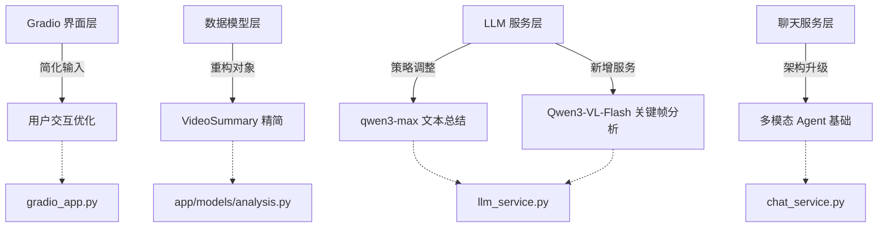
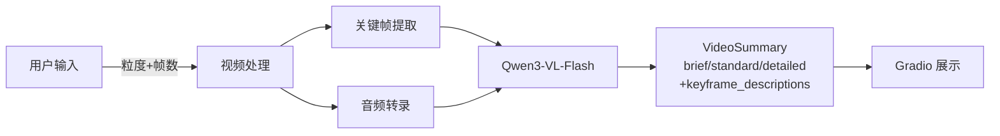
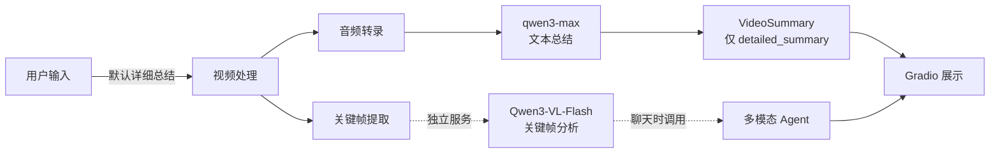
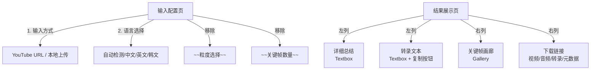
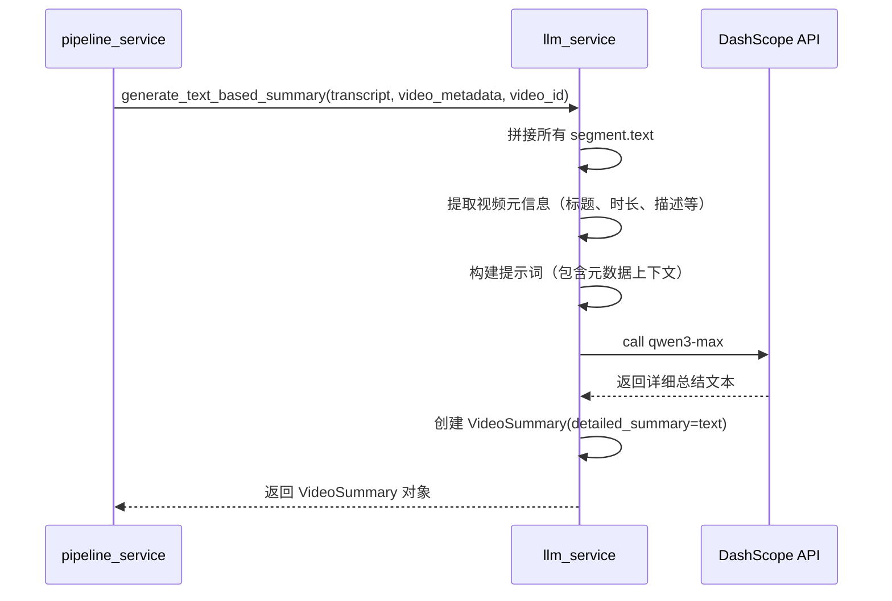
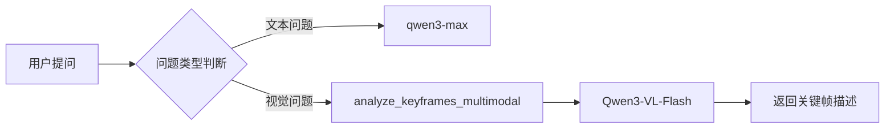
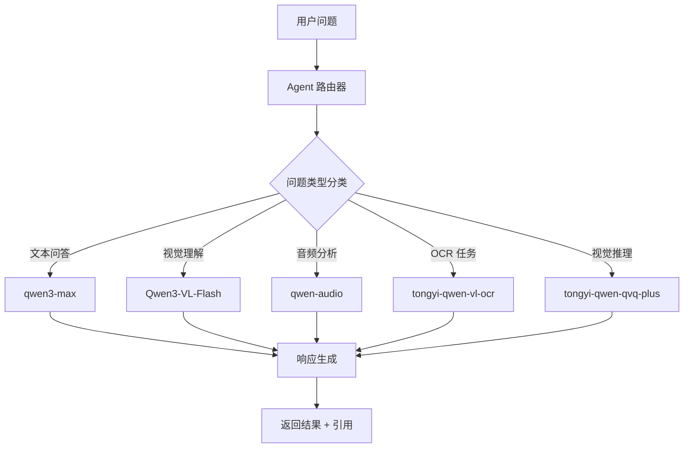
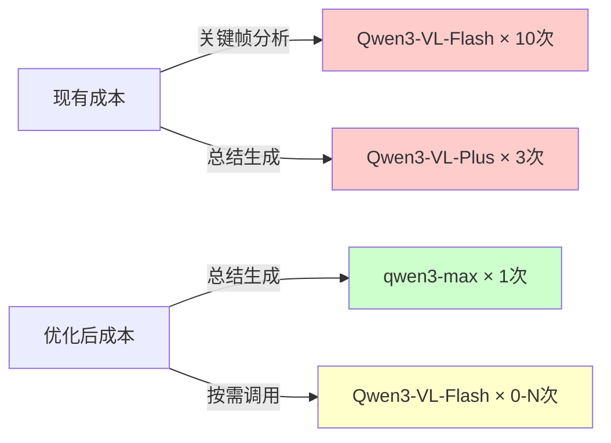
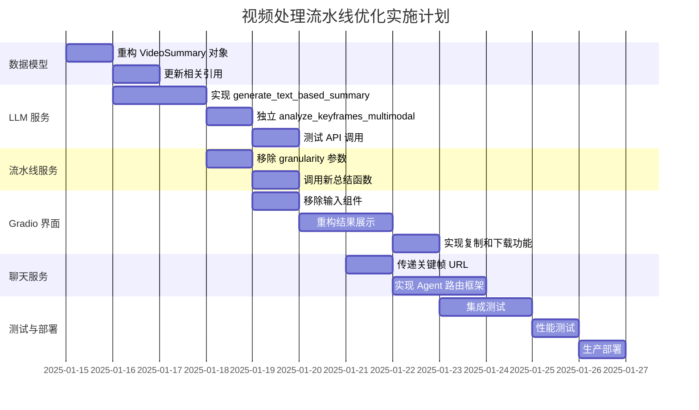

# 视频处理流水线优化设计文档

## 1. 概述

### 1.1 设计目标

本次优化基于现有视频处理流水线（v0.1.2），旨在实现以下核心改进：

- **简化用户交互**：移除冗余的用户输入选项，提供更流畅的体验
- **重构数据模型**：精简 `VideoSummary` 对象结构，移除不必要的字段
- **优化 LLM 策略**：分离文本总结与多模态分析，提升处理效率
- **增强聊天功能**：为未来的多模态 Agent 框架奠定基础

### 1.2 设计原则

| 原则 | 说明 |
|-----|------|
| **单一职责** | 将文本总结与多模态分析明确分离为独立服务 |
| **前瞻性设计** | 为未来 Agent 框架预留扩展接口 |
| **用户体验优先** | 简化配置项，减少认知负担 |
| **资源优化** | 避免不必要的 API 调用，降低成本 |

### 1.3 影响范围



## 2. 技术架构

### 2.1 系统架构变更对比

#### 当前架构（v0.1.2）


#### 优化后架构（v0.2.0）


### 2.2 数据流转重构

| 阶段 | 当前流程 | 优化后流程 | 变更说明 |
|-----|---------|-----------|---------|
| **用户输入** | 粒度选择 + 帧数滑块 | 移除所有配置项 | 默认详细总结，固定最多10帧 |
| **视频总结** | Qwen3-VL-Flash（图像+文本） | qwen3-max（仅文本） | 降低成本，提升速度 |
| **关键帧分析** | 融合在总结流程中 | 独立微服务 | 按需调用，避免浪费 |
| **聊天初始化** | 仅传递转录文本 | 转录文本 + 关键帧 URL | 支持多模态问答 |

## 3. 数据模型重构

### 3.1 VideoSummary 对象变更

#### 现有结构
```
VideoSummary
├─ video_id: str
├─ brief_summary: str          [删除]
├─ standard_summary: str        [删除]
├─ detailed_summary: str        [保留]
├─ sections: List[SummarySection] [删除]
├─ keyframe_descriptions: List[KeyframeDescription] [删除]
├─ language: str               [删除]
└─ generated_at: str           [删除]
```

#### 优化后结构
```
VideoSummary
├─ video_id: str
└─ detailed_summary: str  # 唯一字段
```

**设计决策**：
- **移除多粒度字段**：用户不再选择粒度，系统统一生成详细总结
- **移除关键帧描述**：该功能迁移至独立的多模态分析服务
- **移除时间线段落**：简化数据结构，减少存储开销
- **移除元信息**：language 和 generated_at 可从 VideoMetadata 推断

### 3.2 VideoMetadata 保持不变

**重要**：`VideoMetadata.keyframes` 列表及其 OSS URL **必须保留**，原因：
1. 聊天功能需要访问关键帧图像
2. 为未来的视频帧裁剪功能预留数据
3. 独立的关键帧分析服务依赖此数据

## 4. 核心功能设计

### 4.1 用户界面简化（Gradio 界面）

#### 变更内容

| 组件 | 当前状态 | 优化后 | 理由 |
|-----|---------|--------|------|
| `granularity` 下拉框 | 简要/标准/详细 | **移除** | 默认生成详细总结 |
| `num_keyframes` 滑块 | 5-20 可选 | **移除** | 固定使用三层策略（最多10帧） |
| 总结展示区域 | 3 个 Textbox（brief/standard/detailed） | **1 个 Textbox** | 仅显示 `detailed_summary` |
| 转录文本组件 | Textbox | **Textbox + 复制按钮** | 提升可用性 |
| 下载链接区域 | 视频/音频/元数据 | **新增转录文本下载** | 提供 `.txt` 文件下载 |

#### 界面布局



### 4.2 LLM 服务重构

#### 4.2.1 文本总结服务（新增）

**服务定义**：
- **函数名称**：`generate_text_based_summary()`
- **输入参数**：
  - `transcript: TranscriptMetadata` - 完整转录文本
  - `video_metadata: Dict[str, Any]` - 视频元数据（来自 yt-dlp 或 ffprobe）
  - `video_id: str` - 视频标识
- **调用模型**：`qwen3-max`（通过 DashScope API）
- **输出**：`VideoSummary` 对象（仅包含 `detailed_summary` 字段）

**处理流程**：


**提示词模板**：
```
基于以下视频的元信息和完整转录文本，生成一份详细的内容总结：

视频元信息：
- 标题：{video_title}
- 时长：{video_duration}
- 描述：{video_description}（如有）
- 上传者/来源：{video_uploader}（如有）

完整转录文本：
{full_transcript_text}

总结要求：
1. 涵盖视频的核心主题和目标
2. 按逻辑结构组织要点（如引言、主体、结论）
3. 提取关键信息和亮点
4. 使用清晰的段落形式
5. 根据视频内容语言自动选择总结语言（中文视频用中文总结，英文视频用英文总结）
6. 总结长度根据视频内容复杂度灵活调整，确保信息完整性
```

#### 4.2.2 多模态关键帧分析服务（独立）

**服务定义**：
- **函数名称**：`analyze_keyframes_multimodal()`
- **输入参数**：
  - `keyframes: List[KeyframeMetadata]` - 关键帧列表（含 OSS URL）
  - `context: Optional[str]` - 可选的上下文文本
- **调用模型**：`Qwen3-VL-Flash`
- **输出**：`List[KeyframeDescription]` - 关键帧描述列表

**重要特性**：
- **不在主流水线中调用**：初始视频处理时不生成关键帧描述
- **按需调用**：仅在聊天功能需要时异步调用
- **独立部署**：可视为微服务，未来可独立扩展

**调用时机**：


### 4.3 聊天功能升级

#### 4.3.1 初始调用变更

**目标**：验证多模态输入传递的可行性

**输入内容扩展**：

| 输入类型 | 现有版本 | 优化后 | 数据来源 |
|---------|---------|--------|---------|
| 转录文本 | ✅ | ✅ | `TranscriptMetadata.segments` 拼接 |
| 关键帧 URL | ❌ | ✅ | `VideoMetadata.keyframes[].oss_image_url` |
| 用户查询 | ✅ | ✅ | 用户输入 |

**调用示例**：
```
启动会话时：
1. 获取 VideoMetadata
2. 提取完整转录文本
3. 提取所有关键帧 OSS URL
4. 构建初始上下文：
   content_parts = [
       {"text": "完整视频转录：{full_transcript}"},
       {"image": keyframes[0].oss_image_url},
       {"image": keyframes[1].oss_image_url},
       ...
       {"text": "用户问题：{user_query}"}
   ]
5. 调用 Qwen3-VL-Flash
```

#### 4.3.2 多模态 Agent 框架设计

**架构愿景**：



**元数据访问能力**：

Agent 必须能够访问所有已生成的模态数据：

| 数据类型 | 来源字段 | 用途 |
|---------|---------|------|
| 原视频 | `VideoMetadata.oss_video_url` | 视频片段分析 |
| 音频 | `VideoMetadata.transcript.oss_audio_url` | 音频情感分析 |
| 关键帧 | `VideoMetadata.keyframes[].oss_image_url` | 视觉问答 |
| 转录文本 | `VideoMetadata.transcript.segments` | 文本检索 |
| 元数据 | `VideoMetadata.metadata_oss_url` | 完整上下文 |

**路由策略表**：

| 用户查询类型 | 示例问题 | 推荐模型 | 输入数据 |
|------------|---------|---------|---------|
| 事实性问答 | "视频主要讲什么？" | qwen3-max | 转录文本 |
| 时间定位 | "在哪里讲了 XXX？" | qwen3-max | 转录文本 + 时间戳 |
| 视觉描述 | "这个画面里有什么？" | Qwen3-VL-Flash | 关键帧 URL |
| 文字识别 | "视频中的文字内容是什么？" | tongyi-qwen-vl-ocr | 关键帧 URL |
| 音频分析 | "说话人的情绪如何？" | qwen-audio | 音频 URL |
| 复杂推理 | "为什么会出现这个现象？" | tongyi-qwen-qvq-plus | 关键帧 + 转录 |

**实施步骤**（当前版本）：

1. **chat_service.py 中新增 Agent 路由逻辑**：
   - 分析用户问题关键词（如"画面"、"图片"→ 视觉类）
   - 简单规则匹配或使用小型分类模型
   
2. **支持模型切换**：
   - 封装不同模型的调用接口
   - 统一返回格式
   
3. **保留扩展接口**：
   - 预留插件式模型注册机制
   - 为未来添加新模型做准备

## 5. 实施指导

### 5.1 修改文件清单

| 文件路径 | 修改类型 | 主要变更 |
|---------|---------|---------|
| `app/models/analysis.py` | **重构** | 精简 `VideoSummary` 对象定义 |
| `app/services/llm_service.py` | **新增+修改** | 新增 `generate_text_based_summary()` + 独立 `analyze_keyframes_multimodal()` |
| `app/services/pipeline_service.py` | **修改** | 调用新的文本总结函数，移除粒度参数 |
| `backend/gradio_app.py` | **修改** | 移除粒度和帧数输入，重构结果展示逻辑 |
| `app/services/chat_service.py` | **修改** | 初始调用传递关键帧 URL，新增 Agent 路由框架 |

### 5.2 关键修改点

#### 5.2.1 数据模型层（app/models/analysis.py）

**变更内容**：

| 操作 | 字段名称 | 说明 |
|-----|---------|------|
| 保留 | `video_id` | 视频标识 |
| 保留 | `detailed_summary` | 详细总结内容 |
| 移除 | `brief_summary` | 不再需要多粒度总结 |
| 移除 | `standard_summary` | 同上 |
| 移除 | `sections` | 简化数据结构 |
| 移除 | `keyframe_descriptions` | 功能迁移至独立服务 |
| 移除 | `language` | 可从元数据推断 |
| 移除 | `generated_at` | 同上 |

**新对象定义**：
```
VideoSummary 对象定义 {
  字段：video_id（类型：字符串）
  字段：detailed_summary（类型：字符串）
}
```

#### 5.2.2 LLM 服务层（llm_service.py）

**新增服务函数**：

| 函数名称 | 功能描述 | 输入参数 | 输出结果 |
|---------|---------|---------|---------|
| `generate_text_based_summary()` | 基于转录和元数据生成详细总结 | `transcript: TranscriptMetadata`<br/>`video_metadata: Dict[str, Any]`<br/>`video_id: str` | `VideoSummary` 对象 |
| `analyze_keyframes_multimodal()` | 多模态关键帧分析 | `keyframes: List[KeyframeMetadata]`<br/>`context: Optional[str]` | `List[KeyframeDescription]` |

**调用模型变更**：

| 场景 | 现有模型 | 优化后模型 | 原因 |
|-----|---------|-----------|------|
| 视频总结 | `Qwen3-VL-Flash` | `qwen3-max` | 仅需文本理解，成本更低 |
| 关键帧分析 | `Qwen3-VL-Flash` | `Qwen3-VL-Flash` | 保持不变，独立调用 |

**处理逻辑**：

```
generate_text_based_summary 函数 {
  步骤1：提取视频元信息
    - 从 video_metadata 中提取：
      * title（标题）
      * duration（时长）
      * description（描述，如有）
      * uploader（上传者，如有）
      * upload_date（上传日期，如有）
  
  步骤2：拼接所有转录片段文本
    - 遍历 transcript.segments
    - 合并为完整文本
  
  步骤3：构建提示词
    - 使用"详细总结"模板
    - 插入视频元信息
    - 插入转录文本
    - 不限定总结字数和语言
  
  步骤4：调用 qwen3-max API
    - 使用 DashScope SDK
    - 设置 max_tokens=2000（增加以支持灵活长度）
  
  步骤5：创建 VideoSummary 对象
    - 设置 video_id
    - 设置 detailed_summary = API返回文本
  
  步骤6：返回对象
}
```

#### 5.2.3 流水线服务层（pipeline_service.py）

**函数签名变更**：

| 函数 | 现有签名 | 优化后 |
|-----|---------|--------|
| `process_video_with_summary()` | `granularity: str = "standard"` | **移除 granularity 参数** |

**调用逻辑变更**：

```
在 process_video_with_summary 中 {
  步骤1-3：保持不变（视频处理、转录、元数据生成）
  
  步骤4：调用新的文本总结服务
    如果 llm_service 可用：
      调用 llm_service.generate_text_based_summary(
        transcript=metadata.transcript,
        video_metadata=video_metadata,
        video_id=video_id
      )
      返回 VideoSummary 对象
    否则：
      video_summary = None
  
  步骤5-6：保持不变（上传元数据、清理临时文件）
  
  返回：{
    status, video_id, metadata, video_summary（新结构）
  }
}
```

**重要**：关键帧提取逻辑保持不变，仍然执行：
- 三层策略提取（PySceneDetect → FFmpeg → 均匀采样）
- 上传到 OSS 获取 `oss_image_url`
- 存储在 `VideoMetadata.keyframes` 中

#### 5.2.4 Gradio 界面层（gradio_app.py）

**输入区域修改**：

| 组件 | 操作 | 理由 |
|-----|------|------|
| `granularity` Dropdown | **完全移除** | 默认详细总结 |
| `num_keyframes` Slider | **完全移除** | 固定使用三层策略 |
| `language` Dropdown | 保留 | 转录仍需语言参数 |
| `input_mode` Radio | 保留 | YouTube/本地上传切换 |

**结果展示区域修改**：

```
结果展示页布局 {
  左列：
    - 详细总结 Textbox（单个）
      * 显示 video_summary.detailed_summary
      * 如果 video_summary 为 None，显示"⚠️ LLM 服务不可用"
    
    - 转录文本 Textbox
      * 显示格式：[时间戳] 文本内容
      * 新增"复制"按钮功能
  
  右列：
    - 关键帧 Gallery
      * 显示 metadata.keyframes[].oss_image_url
      * 保持不变
    
    - 下载链接 HTML
      * 原视频、音频、元数据
      * **新增**：转录文本 .txt 文件下载
}
```

**数据提取逻辑**：

```
在 process_video_wrapper 中 {
  提取总结内容：
    如果 video_summary 存在：
      detailed_summary = video_summary.detailed_summary 或 "无详细总结"
    否则：
      detailed_summary = "⚠️ LLM 总结服务不可用"
  
  提取转录文本：
    如果 metadata.transcript.segments 存在：
      拼接为 "[开始-结束] 文本" 格式
    否则：
      transcript_text = "⚠️ 无转录内容"
  
  提取关键帧：
    转换 metadata.keyframes 为 Gallery 格式
    格式：[(oss_image_url, caption), ...]
  
  生成下载链接：
    新增转录文本下载：
      创建临时 .txt 文件
      内容 = transcript_text
      提供下载链接
}
```

**复制按钮实现**：

```
转录文本复制功能 {
  方式1：使用 Gradio 原生组件
    - gr.Textbox(..., show_copy_button=True)
  
  方式2（如果原生不支持）：
    - 使用 JavaScript 注入
    - 添加自定义按钮触发 clipboard API
}
```

#### 5.2.5 聊天服务层（chat_service.py）

**初始调用变更**：

```
在 ask_question 函数中 {
  步骤1：保持不变（获取完整转录文本）
  
  步骤2：新增关键帧提取逻辑
    从 session.keyframes 中提取所有 oss_image_url
    
  步骤3：构建多模态消息
    content_parts = [
      {"text": "用户问题：{question}"},
      {"text": "完整视频转录：{full_transcript}"},
      {"image": keyframe1.oss_image_url},
      {"image": keyframe2.oss_image_url},
      ...
    ]
  
  步骤4：调用 Qwen3-VL-Flash
    模型：llm_service.vision_model（qwen-vl-max）
    输入：messages（含文本+图像）
  
  步骤5：保持不变（返回答案+引用）
}
```

**Agent 路由框架（新增）**：

```
新增 Agent 路由逻辑 {
  功能：根据问题类型选择最佳模型
  
  classify_question(question: str) -> str {
    关键词映射：
      "画面"/"图片"/"看到" → "visual"
      "文字"/"字幕"/"OCR" → "ocr"
      "情绪"/"语气"/"声音" → "audio"
      "为什么"/"原因"/"推理" → "reasoning"
      其他 → "text"
    
    返回：问题类型
  }
  
  route_to_model(question_type: str, context: dict) -> dict {
    如果 question_type == "visual"：
      调用 Qwen3-VL-Flash（关键帧 URL + 问题）
    
    如果 question_type == "ocr"：
      调用 tongyi-qwen-vl-ocr（关键帧 URL）
    
    如果 question_type == "audio"：
      调用 qwen-audio（音频 URL + 问题）
    
    如果 question_type == "reasoning"：
      调用 tongyi-qwen-qvq-plus（关键帧 + 转录）
    
    否则：
      调用 qwen3-max（仅转录文本）
    
    返回：{model: str, inputs: dict}
  }
}
```

**元数据访问接口**：

```
元数据访问设计 {
  在 ChatSession 对象中保存：
    - video_id
    - transcript（TranscriptMetadata）
    - keyframes（List[KeyframeMetadata]）
    - oss_video_url（从 VideoMetadata 获取）
    - oss_audio_url（从 TranscriptMetadata 获取）
  
  新增 getter 方法：
    get_keyframe_urls() -> List[str]
    get_audio_url() -> str
    get_video_url() -> str
    get_full_transcript() -> str
  
  Agent 路由时使用这些方法获取所需数据
}
```

### 5.3 向后兼容性

**关键考量**：

| 影响点 | 兼容性策略 |
|-------|----------|
| 已存储的 VideoSummary | 读取时检查字段是否存在，缺失字段使用默认值 |
| API 响应格式 | 保持 `video_summary` 字段名称不变，仅内部结构简化 |
| 前端展示 | 如果 `detailed_summary` 缺失，显示占位符 |
| 聊天历史 | 新旧会话独立，不影响现有会话 |

**迁移策略**：

```
数据迁移建议 {
  对于旧版 VideoSummary 对象：
    如果包含 brief_summary 或 standard_summary：
      合并为 detailed_summary
      公式：detailed_summary = brief + "\n\n" + standard + "\n\n" + (detailed 或 "")
    
    如果包含 keyframe_descriptions：
      忽略（不再使用）
    
    保存为新格式
}
```

### 5.4 测试要点

| 测试场景 | 验证内容 | 预期结果 |
|---------|---------|---------|
| **视频处理** | 不传递 granularity 参数 | 默认生成详细总结 |
| **VideoSummary 对象** | 检查返回的对象结构 | 仅包含 video_id 和 detailed_summary |
| **LLM 调用** | 监控 API 调用日志 | 使用 qwen3-max 而非 Qwen3-VL-Flash |
| **Gradio 界面** | 检查输入区域 | 无粒度和帧数选项 |
| **Gradio 展示** | 检查结果区域 | 仅1个总结 Textbox |
| **转录复制** | 点击复制按钮 | 文本成功复制到剪贴板 |
| **转录下载** | 点击下载链接 | 下载 .txt 文件 |
| **聊天初始化** | 检查传递给 LLM 的 content_parts | 包含文本和图像 URL |
| **Agent 路由** | 提问"画面中有什么？" | 调用 Qwen3-VL-Flash |
| **关键帧保留** | 检查 VideoMetadata | keyframes 列表完整且有 oss_image_url |

### 5.5 性能优化

**预期改进**：

| 指标 | 现有版本 | 优化后 | 提升 |
|-----|---------|--------|------|
| **单视频处理时间** | 2-10 分钟 | 1.5-8 分钟 | ~20% |
| **LLM API 调用次数** | 关键帧数量 + 3次总结 | 1次总结 | 降低 70-80% |
| **API 成本** | 高（多模态调用） | 中（文本调用为主） | 降低 40-60% |
| **用户配置时间** | 需选择2个参数 | 0个参数 | 100%简化 |

**成本分析**：



## 6. 风险与缓解

### 6.1 潜在风险

| 风险 | 影响 | 概率 | 缓解措施 |
|-----|------|------|---------|
| **qwen3-max 总结质量下降** | 用户体验下降 | 中 | 优化提示词，对比测试 |
| **关键帧未被使用** | 资源浪费 | 低 | 在聊天中频繁调用视觉功能 |
| **旧数据不兼容** | 系统错误 | 中 | 实施数据迁移脚本 |
| **Agent 路由错误** | 答案不准确 | 中 | 增加用户反馈机制，持续优化 |

### 6.2 回滚计划

如果优化效果不佳，回滚步骤：

```
回滚流程 {
  步骤1：恢复 VideoSummary 旧结构
    - 重新添加 brief_summary、standard_summary 等字段
  
  步骤2：恢复 Gradio 输入组件
    - 重新添加 granularity Dropdown
    - 重新添加 num_keyframes Slider
  
  步骤3：恢复 LLM 调用逻辑
    - 使用 Qwen3-VL-Flash 进行总结
    - 在主流水线中生成关键帧描述
  
  步骤4：回滚聊天服务
    - 移除关键帧 URL 传递
    - 禁用 Agent 路由逻辑
  
  预计回滚时间：< 2 小时
}
```

## 7. 实施时间线



**总计**：约 10-12 个工作日

## 8. 验收标准

### 8.1 功能验收

- [ ] 用户界面无粒度和帧数选项
- [ ] VideoSummary 对象仅包含 video_id 和 detailed_summary
- [ ] 视频总结调用 qwen3-max
- [ ] 关键帧仍然提取并上传到 OSS
- [ ] 聊天初始化传递转录文本和关键帧 URL
- [ ] 转录文本支持复制和下载
- [ ] Agent 路由逻辑能识别简单问题类型
- [ ] 所有现有测试用例通过
- [ ] 向后兼容旧版数据

### 8.2 性能验收

- [ ] 单视频处理时间减少 > 15%
- [ ] LLM API 调用次数减少 > 60%
- [ ] 总结质量评分 ≥ 4.0/5.0（用户评价）
- [ ] 系统响应时间 < 3秒（界面交互）

### 8.3 代码质量

- [ ] 所有修改遵循现有代码规范
- [ ] 新增函数包含完整文档字符串
- [ ] 关键逻辑添加日志记录
- [ ] 无新增严重级别代码告警

## 9. 附录

### 9.1 关键术语表

| 术语 | 定义 |
|-----|------|
| **VideoSummary** | 视频总结数据对象，优化后仅包含详细总结字段 |
| **VideoMetadata** | 视频元数据对象，包含所有处理后的资源链接 |
| **qwen3-max** | 阿里云大语言模型，专注文本理解和生成 |
| **Qwen3-VL-Flash** | 多模态视觉语言模型，支持图像+文本输入 |
| **Agent 路由** | 根据问题类型动态选择最合适的 LLM 模型 |
| **三层策略** | 关键帧提取的三种降级方法（PySceneDetect/FFmpeg/均匀采样） |

### 9.2 相关文档

| 文档名称 | 路径 | 说明 |
|---------|------|------|
| 当前数据流文档 | `CURRENT_DATAFLOW.md` | 现有架构详细说明 |
| API 集成指南 | `backend/app/services/llm_service.py` | LLM 服务实现 |
| Gradio 用户手册 | `backend/GRADIO_USER_GUIDE.md` | 界面使用说明 |

### 9.3 技术依赖

| 依赖项 | 版本要求 | 用途 |
|-------|---------|------|
| DashScope SDK | 最新 | 调用阿里云 LLM API |
| Gradio | ≥ 3.40 | Web 界面框架 |
| PySceneDetect | ≥ 0.6 | 关键帧提取 |
| FFmpeg | ≥ 4.0 | 音视频处理 |
| Paraformer-v2 | 最新 | 音频转录 |
