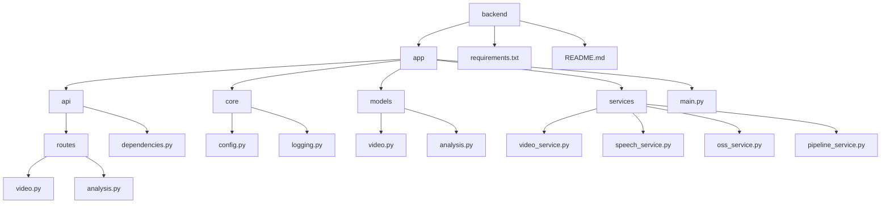
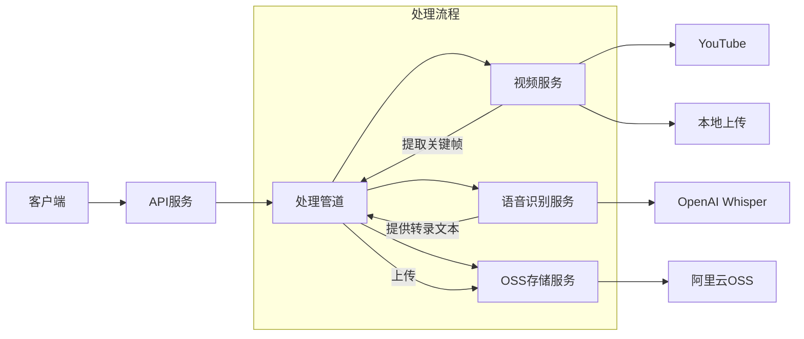
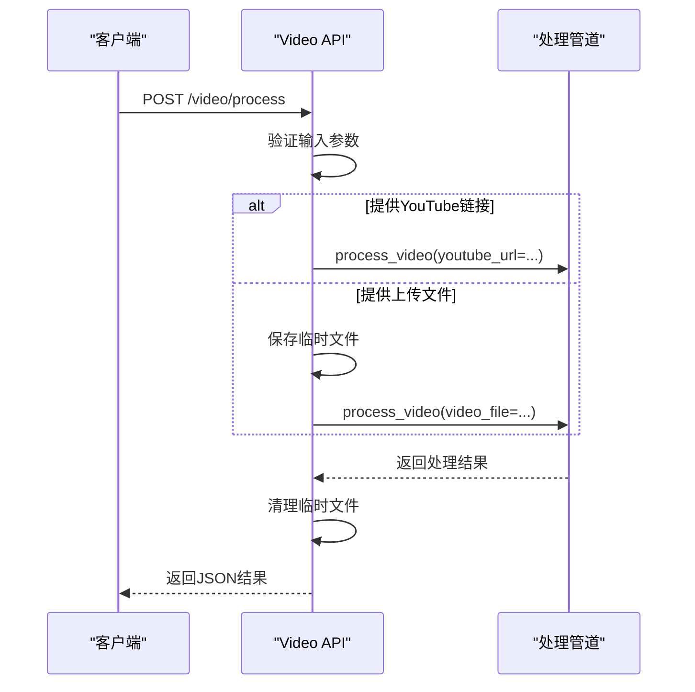
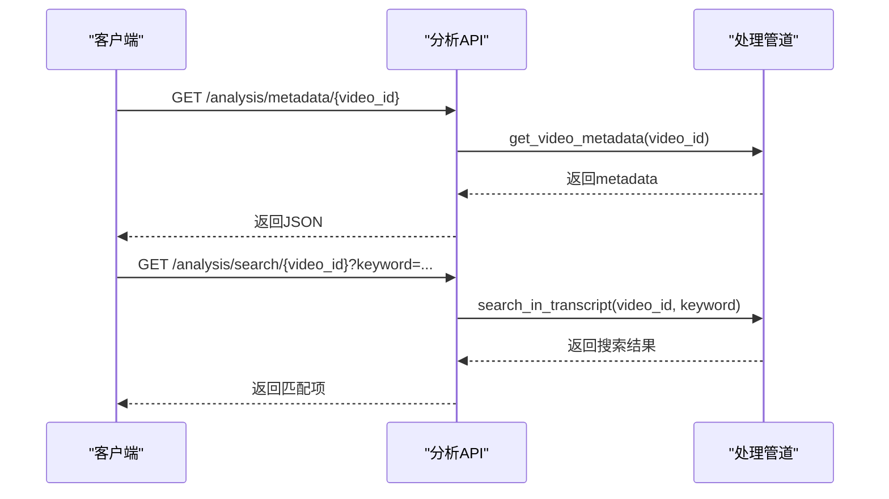
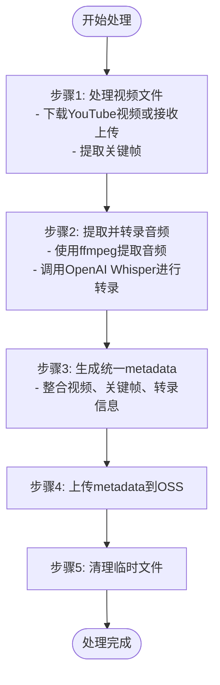
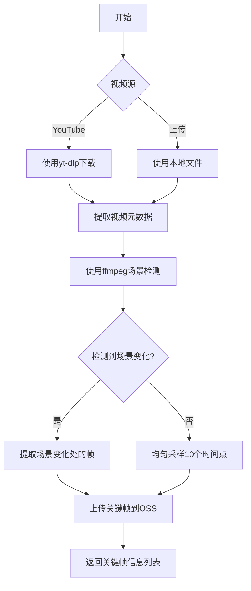
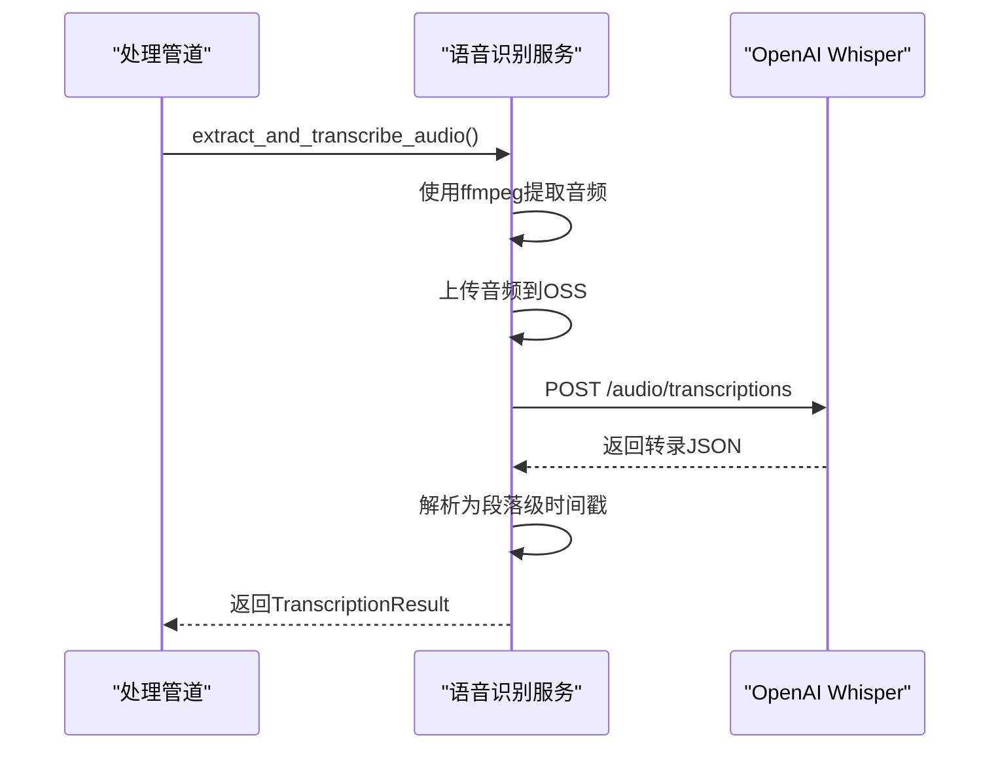
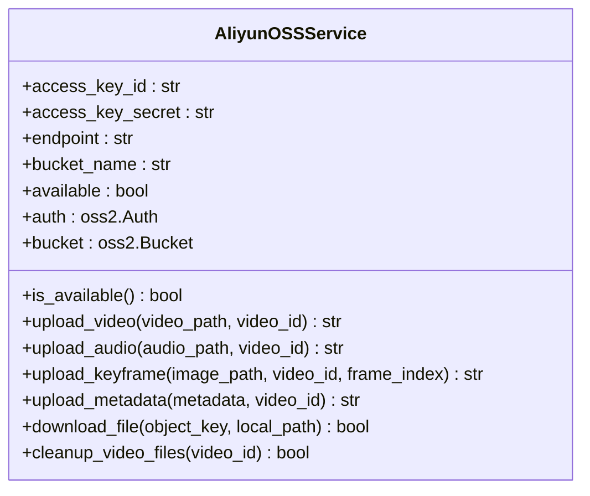
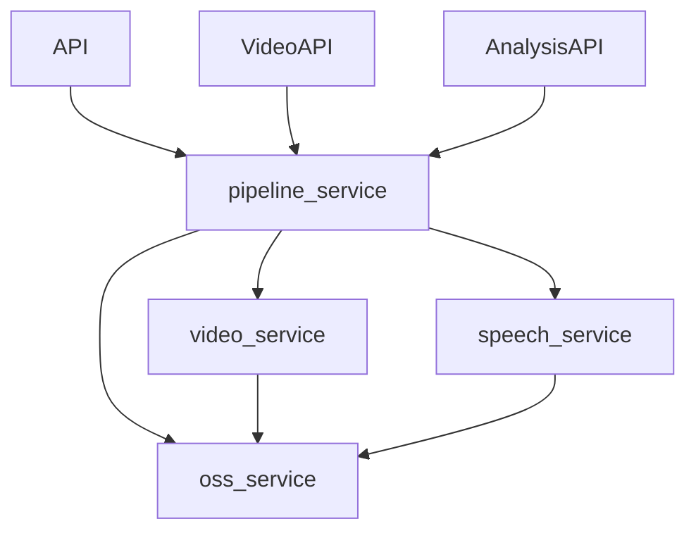

# 简化架构

<cite>
**本文档引用的文件**  
- [main.py](file://backend/app/main.py)
- [video.py](file://backend/app/api/routes/video.py)
- [analysis.py](file://backend/app/api/routes/analysis.py)
- [pipeline_service.py](file://backend/app/services/pipeline_service.py)
- [video_service.py](file://backend/app/services/video_service.py)
- [speech_service.py](file://backend/app/services/speech_service.py)
- [oss_service.py](file://backend/app/services/oss_service.py)
- [config.py](file://backend/app/core/config.py)
- [README.md](file://backend/README.md)
</cite>

## 目录
1. [简介](#简介)
2. [项目结构](#项目结构)
3. [核心组件](#核心组件)
4. [架构概览](#架构概览)
5. [详细组件分析](#详细组件分析)
6. [依赖分析](#依赖分析)
7. [性能考量](#性能考量)
8. [故障排查指南](#故障排查指南)
9. [结论](#结论)

## 简介
本项目为“阿里云视频分析平台”后端服务，旨在提供一个简化但功能完整的视频处理架构。系统支持从YouTube链接或本地上传的视频文件中提取关键帧、音频转录，并生成统一的元数据（metadata）。整个架构采用模块化设计，各服务职责清晰，便于维护和扩展。

该简化架构的核心优势在于：
- **高内聚、低耦合**：每个服务（如视频处理、语音识别、OSS存储）独立封装，通过明确定义的接口交互。
- **异步处理**：利用Python的`asyncio`实现非阻塞I/O，提升并发处理能力。
- **统一数据流**：通过`pipeline_service`协调所有处理步骤，确保数据格式一致。
- **易于部署**：基于FastAPI构建，支持Swagger UI和ReDoc文档，便于调试和集成。

**Section sources**
- [README.md](file://backend/README.md#L1-L93)

## 项目结构
项目采用典型的分层架构，按功能划分模块，结构清晰，易于导航。

**Diagram sources**
- [README.md](file://backend/README.md#L10-L45)

**Section sources**
- [README.md](file://backend/README.md#L10-L45)

## 核心组件
系统的核心由四个主要服务构成：API路由、视频处理、语音识别和OSS存储，它们通过处理管道（pipeline）协调工作。

- **API路由**：作为系统的入口，接收外部请求并分发给相应的处理服务。
- **视频处理服务**（video_service）：负责视频的下载、元数据提取和关键帧抽取。
- **语音识别服务**（speech_service）：使用OpenAI的Whisper模型将音频转录为文本。
- **OSS存储服务**（oss_service）：将处理后的视频、音频、关键帧和元数据上传至阿里云对象存储。
- **处理管道服务**（pipeline_service）：协调上述服务，实现完整的视频分析流程。

这些组件共同构成了一个端到端的视频摘要系统。

**Section sources**
- [main.py](file://backend/app/main.py#L1-L48)
- [pipeline_service.py](file://backend/app/services/pipeline_service.py#L1-L297)

## 架构概览
下图展示了系统的整体架构和组件间的交互流程。

**Diagram sources**
- [main.py](file://backend/app/main.py#L1-L48)
- [pipeline_service.py](file://backend/app/services/pipeline_service.py#L1-L297)

## 详细组件分析
### API路由分析
API路由是系统的前端接口，定义了外部可访问的端点。

#### 视频处理API

**Diagram sources**
- [video.py](file://backend/app/api/routes/video.py#L1-L91)

#### 分析API

**Diagram sources**
- [analysis.py](file://backend/app/api/routes/analysis.py#L1-L60)

**Section sources**
- [video.py](file://backend/app/api/routes/video.py#L1-L91)
- [analysis.py](file://backend/app/api/routes/analysis.py#L1-L60)

### 处理管道服务分析
`pipeline_service`是整个系统的大脑，协调所有服务完成视频分析任务。

#### 视频处理流程

**Diagram sources**
- [pipeline_service.py](file://backend/app/services/pipeline_service.py#L1-L297)

**Section sources**
- [pipeline_service.py](file://backend/app/services/pipeline_service.py#L1-L297)

### 视频服务分析
视频服务负责视频的输入处理和关键帧提取。

#### 关键帧提取流程

**Diagram sources**
- [video_service.py](file://backend/app/services/video_service.py#L1-L503)

**Section sources**
- [video_service.py](file://backend/app/services/video_service.py#L1-L503)

### 语音识别服务分析
语音识别服务使用OpenAI的Whisper API进行高精度转录。

**Diagram sources**
- [speech_service.py](file://backend/app/services/speech_service.py#L1-L350)

**Section sources**
- [speech_service.py](file://backend/app/services/speech_service.py#L1-L350)

### OSS存储服务分析
OSS服务负责与阿里云对象存储的交互。

**Diagram sources**
- [oss_service.py](file://backend/app/services/oss_service.py#L1-L272)

**Section sources**
- [oss_service.py](file://backend/app/services/oss_service.py#L1-L272)

## 依赖分析
系统依赖关系清晰，形成了一个以`pipeline_service`为核心的星型结构。

这种设计确保了高内聚和低耦合，每个服务可以独立开发和测试。

**Diagram sources**
- [pipeline_service.py](file://backend/app/services/pipeline_service.py#L1-L297)
- [video_service.py](file://backend/app/services/video_service.py#L1-L503)
- [speech_service.py](file://backend/app/services/speech_service.py#L1-L350)
- [oss_service.py](file://backend/app/services/oss_service.py#L1-L272)

**Section sources**
- [pipeline_service.py](file://backend/app/services/pipeline_service.py#L1-L297)

## 性能考量
- **异步处理**：所有I/O操作（如网络请求、文件读写）均使用`async/await`，避免阻塞主线程。
- **资源管理**：使用临时目录管理会话文件，并在处理完成后自动清理，防止磁盘空间耗尽。
- **并行执行**：在`pipeline_service`中，音频转录任务被创建为异步任务，与关键帧提取并行执行。
- **外部服务依赖**：性能受外部服务（如YouTube下载速度、OpenAI API响应时间）影响较大，建议在生产环境中添加超时和重试机制。

## 故障排查指南
常见问题及解决方案：

- **视频处理失败**：检查`youtube_url`是否有效，或上传的视频文件是否损坏。
- **OSS上传失败**：确认环境变量`ALIYUN_ACCESS_KEY_ID`等配置正确，且网络可访问OSS服务。
- **音频转录失败**：检查`OPENAI_API_KEY`是否设置，API配额是否充足。
- **关键帧提取为空**：可能是视频场景变化不明显，系统会自动回退到均匀采样。
- **服务启动失败**：确保已安装所有依赖（`pip install -r requirements.txt`）。

**Section sources**
- [README.md](file://backend/README.md#L47-L93)
- [pipeline_service.py](file://backend/app/services/pipeline_service.py#L1-L297)
- [video_service.py](file://backend/app/services/video_service.py#L1-L503)

## 结论
该简化架构成功实现了从视频输入到内容分析的完整流程。其模块化设计、清晰的职责划分和异步处理能力，使其成为一个高效、可维护的视频分析解决方案。未来可扩展的方向包括：支持更多视频源、集成阿里云语音服务作为备选、增加缓存机制以提高重复请求的响应速度。