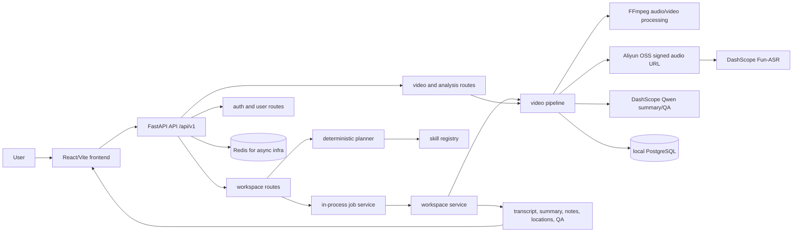

# VidSnap — a glass-box AI video workbench


> **看着 AI 展示它的工作。** 上传本地视频、写下自然语言目标，VidSnap 把它变成可搜索、可引用、可复用的文本资产——而且全程透明：planner 的计划、每个技能的执行 trace、带时间戳引用的产物、以及一份公开的规划质量成绩单。
>
> **Watch the AI show its work.** Turn a local video into searchable, citable, reusable text assets — with the plan, the per-skill execution trace, citation-backed artifacts, and a public planner report card, all visible.

## 为什么是 glass-box / Why glass-box

| 支柱 | 你能看到什么 |
| --- | --- |
| **透明 Transparent** | 工具调用链路实时可视化：planner 选了哪些技能、每步状态与耗时——没有黑盒 |
| **可审计 Auditable** | 摘要 / 笔记 / 问答全部锚定转录时间戳引用（transcript 是唯一事实源），不凭空捏造 |
| **可复现 Reproducible** | 顶部徽章 = **120 条 planner golden set 的实时跑分**，每次 push 由 CI 重跑并公开更新 |

> 🛠️ 本项目由一个自主 AI 工程循环持续迭代——开发过程同样 glass-box：见 [构建日志 / Build Log](docs/build-log.md)。

## 核心特性

- 本地视频上传：支持 MP4、MOV、MKV、AVI、WEBM、M4V。
- Query-first 工作区：先写目标，再生成结构化技能计划，不让用户手动选择处理菜单。
- 可恢复异步任务：`/workspace/jobs` 返回 job 状态、阶段进度、重试信息和 artifact 版本。
- 转录优先事实源：Fun-ASR 生成带时间戳的 transcript，摘要、笔记、定位和问答都基于 transcript。
- 云端音频中转：通过阿里云 OSS 提供 Fun-ASR 可访问的音频 URL，默认使用签名 URL 支持私有 bucket。
- 本地开发闭环：FastAPI + React/Vite + PostgreSQL + Redis，一条脚本启动完整环境。

## 快速上手

### 前置条件

- Python >= 3.10
- Node.js >= 18
- Docker Desktop 或本机 Docker
- FFmpeg
- 阿里云 DashScope API Key
- 如需真实 Paraformer 转录：阿里云 OSS bucket 和 AccessKey

### 安装依赖

```bash
cd backend
python -m pip install -r requirements.txt

cd ../frontend
npm ci
```

### 配置环境变量

```bash
cp backend/.env.example backend/.env
```

至少填写：

```bash
QWEN_API_KEY=your_dashscope_key
TRANSCRIPT_SERVICE_API_KEY=your_dashscope_key

# Paraformer 需要可访问的音频 URL；真实转录时打开 OSS。
ENABLE_OSS_UPLOADS=true
ALIYUN_ACCESS_KEY_ID=your_access_key_id
ALIYUN_ACCESS_KEY_SECRET=your_access_key_secret
ALIYUN_OSS_ENDPOINT=oss-ap-southeast-1.aliyuncs.com
ALIYUN_OSS_BUCKET=your_bucket_name
OSS_USE_SIGNED_URLS=true
```

配置优先级是系统环境变量最高，项目根目录 `.env` 填充缺失值，`backend/.env` 继续填充缺失值；`start_local.sh` 仍会检查 `backend/.env` 是否存在。

### 启动完整本地环境

```bash
./start_local.sh
```

启动后访问：

- Frontend: http://localhost:8081
- Backend: http://localhost:8000
- Swagger UI: http://localhost:8000/docs
- Health: http://localhost:8000/health

也可以分开启动：

```bash
docker-compose up -d

cd backend
uvicorn app.main:app --host 0.0.0.0 --port 8000 --reload

cd ../frontend
npm run dev -- --port 8081 --host 0.0.0.0
```

## YouTube 视频支持（可选）

除本地文件外，VidSnap 支持直接分析 YouTube 链接。交互是 **AI-native 的斜杠命令**：在「目标」输入框打 `/` 唤起命令菜单，选 `/youtube`：

```
/youtube <YouTube 链接> <你的目标>
例：/youtube https://youtu.be/xxxx 整理成带截图的图文笔记
```

> ⚠️ **要真正下载成功，需配齐下面三件套（缺一不可）。** 这是 YouTube 反爬的现状；`FetchYouTube` skill 只提供接口、**不对反爬兜底**。

1. **Deno**（解 YouTube nsig challenge；缺了会报 `No video formats found`）
   ```bash
   brew install deno            # 或见 https://deno.com
   ```
2. **bgutil PO Token**（过 YouTube PO Token 要求；本地推荐 script 模式，零运维）
   ```bash
   pip install bgutil-ytdlp-pot-provider
   # .env 指向 bgutil 的 node 生成脚本：
   BGUTIL_SCRIPT_PATH=/path/to/bgutil-ytdlp-pot-provider/server/build/generate_once.js
   ```
3. **cookie**（过 bot check；浏览器需已登录 YouTube）
   ```bash
   # .env
   YOUTUBE_COOKIES_FROM_BROWSER=chrome     # 或 safari / firefox
   ```

**提示**：真实**住宅 IP** 反爬宽松；数据中心/代理 IP 会触发最严反爬（captcha / SABR）。三件套齐则下、缺任一则失败。bgutil 的两种运行模式（本地 `script` vs 服务器 `http` sidecar）见 [部署文档](docs/deployment.md)。

## 第一个 API Demo

先验证服务：

```bash
curl http://localhost:8000/health
curl http://localhost:8000/api/v1/video/status
```

只测试 planner，不需要上传视频：

```bash
curl -X POST http://localhost:8000/api/v1/workspace/plan \
  -H "Content-Type: application/json" \
  -d '{"query":"把这个课程整理成结构化复习笔记"}'
```

提交一个可恢复异步任务：

```bash
curl -X POST http://localhost:8000/api/v1/workspace/jobs \
  -F "video_file=@/absolute/path/to/video.webm" \
  -F "query=把这个课程整理成结构化复习笔记" \
  -F "provider=paraformer"
```

拿到 `job_id` 后轮询：

```bash
curl http://localhost:8000/api/v1/workspace/jobs/job_xxxxxxxxxxxxxxxx
curl http://localhost:8000/api/v1/workspace/jobs/job_xxxxxxxxxxxxxxxx/artifact
```

## 架构速览



核心心智模型：

```text
Local Video + User Query -> Skill Plan -> Transcript Index -> Reusable Artifact
```

Transcript 是默认事实源。除非用户明确要求截图、画面或图文笔记，P0 不把视觉帧提取作为默认路径。

## 文档地图

- [文档首页](docs/README.md)
- [快速开始](docs/getting-started.md)
- [系统架构](docs/architecture.md)
- [配置手册](docs/configuration.md)
- [部署与生产环境](docs/deployment.md)
- [故障排查](docs/troubleshooting.md)
- [贡献指南](docs/contributing.md)
- [更新日志](docs/changelog.md)
- [P0 Query-first 验收](docs/vidsnap-p0-query-first-todo.md)
- [异步任务验收](docs/vidsnap-async-job-acceptance.md)
- [Slim 产品边界](docs/vidsnap-slim-product-boundary.md)

## 项目结构

```text
.
├── backend/
│   ├── app/
│   │   ├── api/routes/        # FastAPI routes
│   │   ├── core/              # config, auth, logging, app setup
│   │   ├── models/            # Pydantic and database models
│   │   ├── services/          # video, transcript, OSS, LLM, workspace services
│   │   ├── evals/             # planner golden set
│   │   └── tests/             # pytest tests
│   ├── database/migrations/   # local PostgreSQL bootstrap SQL
│   └── requirements.txt
├── frontend/
│   ├── src/components/        # feature and shared UI
│   ├── src/components/ui/     # shadcn/ui primitives
│   ├── src/pages/             # route screens
│   ├── src/services/          # API client
│   └── package.json
├── docs/                      # architecture, setup, deployment, product notes
├── docker-compose.yml         # PostgreSQL and Redis for local development
└── start_local.sh             # local full-stack runner
```

## 常用命令

```bash
./start_local.sh
docker-compose up -d

cd backend && pytest
cd frontend && npm run lint
cd frontend && npm run build
```

## 生产提示

本仓库当前的生产化重点是稳定处理链路，而不是完整平台运维模板。上线前至少需要处理：

- 用强随机值替换 `JWT_SECRET`。
- 收紧 FastAPI CORS，不要在生产使用 `allow_origins=["*"]`。
- 使用云端 PostgreSQL/Redis 或托管数据库，并制定迁移策略。
- 仅通过 Secret Manager、CI Secret 或服务器环境变量注入 DashScope/OSS/SMTP 密钥。
- 为 OSS bucket 配置最小权限 AccessKey、签名 URL、生命周期清理和跨地域网络策略。
- 在反向代理设置足够的上传体积、超时和 SSE/WebSocket 支持。

## License

本项目采用 [MIT License](LICENSE)。

> ⚠️ 开源发布前请先完成 [`SECURITY_PREPUBLISH_CHECKLIST.md`](SECURITY_PREPUBLISH_CHECKLIST.md)：轮换历史中泄露的密钥并清理 git 历史。
