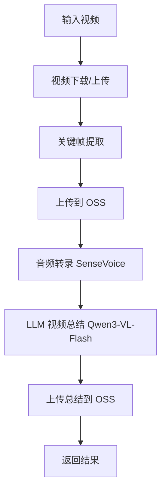

# Qwen3-VL-Flash 视频总结集成指南

## 概述

本文档介绍了 Qwen3-VL-Flash 多模态 LLM 在视频总结系统中的集成，包括架构设计、API 使用方法和测试指南。

## 集成完成时间

**2025-10-18**

## 核心组件

### 1. LLM 服务 (`app/services/llm_service.py`)

#### 主要功能

- **单关键帧分析**: 使用多模态输入（图像 + 文本上下文）生成关键帧描述
- **视频总结生成**: 基于关键帧和转录文本生成多粒度总结
- **时间线同步**: 将总结内容与视频时间线对齐

#### 核心方法

```python
# 分析单个关键帧
async def analyze_keyframe(
    image_url: str,  # OSS 图片 URL
    context: str = ""  # 转录文本上下文
) -> Optional[str]

# 生成完整视频总结
async def generate_video_summary(
    keyframes: List[KeyframeMetadata],
    transcription: TranscriptMetadata,
    video_id: str,
    granularity: str = "standard"  # "brief", "standard", "detailed"
) -> Optional[VideoSummary]

# 检查服务可用性
def is_available() -> bool
```

#### 配置要求

```bash
# 环境变量
QWEN_API_KEY=sk-xxx  # 阿里云 DashScope API 密钥
# 或
DASHSCOPE_API_KEY=sk-xxx
```

### 2. 数据模型 (`app/models/analysis.py`)

#### 新增模型

```python
@dataclass
class KeyframeDescription:
    """单个关键帧的 LLM 分析描述"""
    frame_id: int
    timestamp: float
    description: str
    oss_image_url: str
    confidence: float

@dataclass
class SummarySection:
    """基于时间线的总结段落"""
    start_time: float
    end_time: float
    title: str
    content: str
    keyframe_ids: List[int]

@dataclass
class VideoSummary:
    """完整的视频总结"""
    video_id: str
    brief_summary: str  # 1-2 句话
    standard_summary: str  # 段落级
    detailed_summary: Optional[str]  # 分段详解
    sections: List[SummarySection]
    keyframe_descriptions: List[KeyframeDescription]
    language: str
    generated_at: str
```

### 3. 管道集成 (`app/services/pipeline_service.py`)

#### 新增方法

```python
async def process_video_with_summary(
    video_file: Optional[str] = None,
    youtube_url: Optional[str] = None,
    granularity: str = "standard",
    progress_callback: Optional[callable] = None
) -> Dict[str, Any]
```

#### 处理流程



### 4. API 路由 (`app/api/routes/analysis.py`)

#### 新增端点

##### POST `/analysis/summarize`

生成完整的视频分析和总结。

**请求参数**:
```json
{
  "youtube_url": "https://www.youtube.com/watch?v=xxx",  // 可选
  "video_file": "上传的视频文件",  // 可选
  "granularity": "standard",  // "brief" | "standard" | "detailed"
  "language": "auto"
}
```

**响应示例**:
```json
{
  "status": "success",
  "video_id": "video_20251018_123456",
  "keyframes_count": 5,
  "transcript_segments_count": 20,
  "summary_generated": true,
  "video_summary": {
    "video_id": "video_20251018_123456",
    "brief_summary": "这是一个关于...",
    "standard_summary": "视频主要讨论了...",
    "sections": [...],
    "keyframe_descriptions": [...],
    "language": "zh-CN",
    "generated_at": "2025-10-18T17:30:00"
  },
  "metadata": {...}
}
```

##### GET `/analysis/services/status`

检查所有服务的可用性。

**响应示例**:
```json
{
  "status": "success",
  "services": {
    "video_service": true,
    "speech_service": true,
    "oss_service": true,
    "llm_service": true
  },
  "all_available": true
}
```

## 使用示例

### Python SDK 使用

```python
from app.services.llm_service import llm_service
from app.services.pipeline_service import pipeline

# 检查服务可用性
if llm_service.is_available():
    print("LLM 服务可用")

# 处理视频并生成总结
result = await pipeline.process_video_with_summary(
    youtube_url="https://www.youtube.com/watch?v=Gdzm0-8_61c",
    granularity="standard"
)

if result["status"] == "success":
    summary = result["video_summary"]
    print(f"简要总结: {summary.brief_summary}")
    print(f"标准总结: {summary.standard_summary}")
```

### 命令行测试

```bash
# 运行完整测试
cd backend/app/tests
./run_complete_pipeline_test.sh
```

### cURL API 调用

```bash
# 总结 YouTube 视频
curl -X POST "http://localhost:8000/analysis/summarize" \
  -H "Content-Type: application/json" \
  -d '{
    "youtube_url": "https://www.youtube.com/watch?v=Gdzm0-8_61c",
    "granularity": "standard"
  }'

# 检查服务状态
curl "http://localhost:8000/analysis/services/status"
```

## 测试

### 测试套件

位置: `app/tests/test_complete_pipeline.py`

#### 测试用例

1. **test_qwen_service_availability**: 检查 Qwen VL 服务可用性
2. **test_keyframe_description_generation**: 测试单关键帧描述生成
3. **test_full_video_summarization**: 测试完整视频总结（模拟数据）
4. **test_multiple_granularities**: 测试多种总结粒度
5. **test_timeline_synchronization**: 测试时间线同步
6. **test_complete_pipeline_end_to_end**: 完整端到端测试（真实 YouTube 视频）

#### 运行测试

```bash
# 方式 1: 使用测试脚本
cd backend/app/tests
./run_complete_pipeline_test.sh

# 方式 2: 直接使用 pytest
cd backend
python -m pytest app/tests/test_complete_pipeline.py -v -s

# 方式 3: 运行单个测试
python -m pytest app/tests/test_complete_pipeline.py::TestQwenVLService::test_qwen_service_availability -v -s
```

### 测试报告

测试完成后，报告将自动生成在:
```
backend/app/tests/docs/TEST_COMPLETE_PIPELINE_RESULTS.md
```

## 性能考虑

### 优化策略

1. **批量处理**: 限制并发关键帧分析数量（默认 3 个）
2. **上下文窗口**: 提取关键帧时间附近的转录文本（±15 秒）
3. **Token 限制**: 
   - 简要总结: 200 tokens
   - 标准总结: 500 tokens
   - 详细总结: 1000 tokens
4. **重试机制**: 内置异常处理和日志记录

### 预期性能

- **单关键帧分析**: 2-5 秒
- **完整视频总结**（5 个关键帧）: 20-40 秒
- **端到端管道**（含下载和转录）: 5-10 分钟

## 错误处理

### 常见问题

#### 1. API 密钥无效

**错误**: `Qwen VL 服务不可用`

**解决方案**:
```bash
# 检查环境变量
echo $QWEN_API_KEY

# 设置环境变量
export QWEN_API_KEY=sk-xxx
```

#### 2. OSS 图片 URL 无法访问

**错误**: `API 调用失败`

**解决方案**:
- 确保 OSS 图片 URL 是公共可访问的
- 检查 OSS 存储桶的访问权限

#### 3. API 限流

**错误**: `Rate limit exceeded`

**解决方案**:
- 减少并发请求数量
- 增加重试间隔

#### 4. 上下文长度超限

**错误**: `Context length exceeded`

**解决方案**:
- 减少关键帧数量
- 缩短转录文本上下文窗口

## 未来优化方向

1. **缓存机制**: 缓存关键帧描述，避免重复调用
2. **增量更新**: 支持视频片段的增量总结
3. **多语言支持**: 改进多语言视频的总结质量
4. **自定义提示词**: 允许用户自定义总结风格
5. **质量评估**: 添加总结质量评分机制
6. **流式输出**: 支持流式返回总结内容

## 依赖版本

```txt
dashscope>=1.14.0  # 阿里云 DashScope SDK
oss2>=2.18.0       # 阿里云 OSS
pytest>=7.4.0      # 测试框架
pytest-asyncio>=0.21.0  # 异步测试支持
```

## API 配额管理

### Qwen3-VL-Flash 限制

- **QPM (Queries Per Minute)**: 60
- **QPD (Queries Per Day)**: 10,000
- **并发请求**: 10

### 建议

- 合理控制关键帧数量（建议 5-10 个）
- 实现请求队列和限流机制
- 监控 API 使用量

## 安全考虑

1. **API 密钥保护**: 
   - 使用 `.env` 文件存储
   - 不要提交到版本控制
   
2. **OSS 访问控制**:
   - 使用临时签名 URL
   - 设置合理的过期时间

3. **输入验证**:
   - 验证视频 URL 格式
   - 限制文件大小

## 联系和支持

- **技术文档**: 阿里云 DashScope 官方文档
- **问题反馈**: 提交 GitHub Issue
- **邮件支持**: 团队技术支持邮箱

---

**文档版本**: 1.0  
**最后更新**: 2025-10-18  
**作者**: My_Youtube_Summarizer 团队
