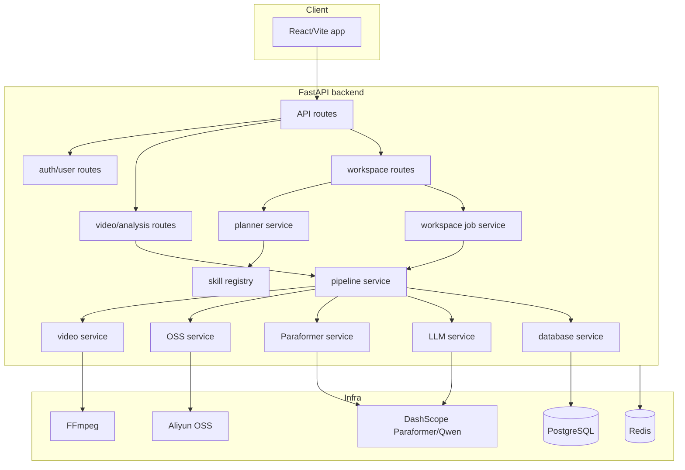
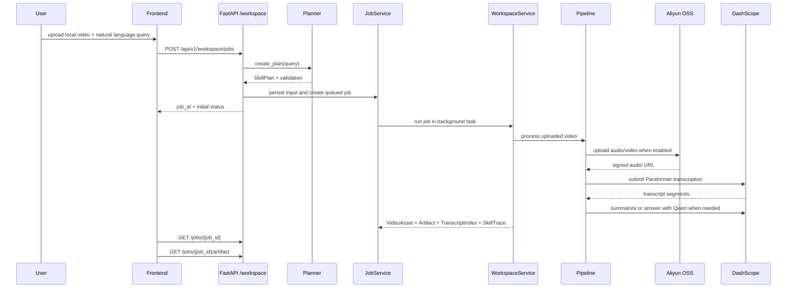

# 系统架构

VidSnap 当前是 FastAPI 后端 + Vite/React 前端 + 本地 PostgreSQL/Redis 的单体开发形态。产品主线正在从“上传后选择处理功能”收敛到 query-first 工作区：

```text
Local Video + User Query -> Skill Plan -> Transcript Index -> Reusable Artifact
```

## 总览



## 核心模块

| 模块 | 路径 | 职责 |
| --- | --- | --- |
| App entry | `backend/app/main.py` | 创建 FastAPI app，注册 `/api/v1` 路由，初始化本地数据库。 |
| Config | `backend/app/core/config.py` | 集中读取 DashScope、OSS、DB、JWT、OAuth、SMTP 等配置。 |
| Video routes | `backend/app/api/routes/video.py` | 接收本地视频，执行 legacy 同步视频处理和历史查询。 |
| Analysis routes | `backend/app/api/routes/analysis.py` | 元数据、转录搜索、总结和聊天 API。 |
| Workspace routes | `backend/app/api/routes/workspace.py` | Query-first planner、同步 workspace process、异步 job、artifact、QA、SSE。 |
| Planner | `backend/app/services/planner_service.py` | P0 规则式 planner，把用户 query 转成确定性 `SkillPlan`。 |
| Skill registry | `backend/app/services/skill_registry_service.py` | 暴露 P0 技能定义并校验 plan 依赖、未知技能、环。 |
| Job runner | `backend/app/services/workspace_job_service.py` | API 进程内的可恢复 job runner，保存状态、输入文件、artifact 版本和重试信息。 |
| Workspace service | `backend/app/services/workspace_service.py` | 执行 query-first 任务，生成 transcript index、artifact 和 skill trace。 |
| Pipeline | `backend/app/services/pipeline_service.py` | 视频处理总编排：元数据、音频、OSS、转录、总结、持久化。 |
| OSS service | `backend/app/services/oss_service.py` | 上传对象、生成 URL、规范化 endpoint、支持签名 URL。 |
| Paraformer service | `backend/app/services/paraformer_service.py` | DashScope Paraformer 异步转录、轮询、重试、长音频切块。 |
| Frontend API client | `frontend/src/services/api.ts` | 前端 API 端点、类型和 fetch 封装。 |

## Query-first 数据流



## 核心概念

### VideoAsset

稳定的视频资产对象，在任务特定 artifact 生成之前创建。字段包括 `video_id`、`title`、`duration`、`source_type=upload`、`processing_status`、`transcript_segments_count` 和 `summary_generated`。

### TranscriptIndex

可检索、可引用的转录片段列表。每个片段包含：

- `segment_index`
- `text`
- `start_time`
- `end_time`
- `confidence`
- `chunk_id`
- `provider`

所有摘要、笔记、定位和问答都应能回到 transcript 证据。

### SkillPlan

Planner 输出的结构化执行计划，包含 `plan_id`、`artifact_type`、有依赖顺序的 `steps`、`assumptions`、`rejected_capabilities` 和 `cost_tier`。

P0 技能：

- `IngestVideo`
- `TranscribeAudio`
- `BuildTranscriptIndex`
- `SummarizeContent`
- `LocateContent`
- `GenerateNotes`
- `AnswerWithContext`
- `ExtractFrames`

`ExtractFrames` 默认关闭，只有用户明确要求截图、画面、图文笔记或视觉输出时才进入 plan。

### Artifact

面向用户的可复用结果，而不是一次性聊天文本。当前 artifact 类型：

- `transcript`
- `summary`
- `notes`
- `content_locations`
- `qa_answer`

Artifact 包含 `artifact_id`、`artifact_type`、`title`、`content`、`format`、`citations` 和 `metadata`。

### WorkspaceJob

异步任务状态对象。关键字段：

- `status`: `queued`、`running`、`succeeded`、`failed`、`canceled`
- `stage`: `queued`、`ingesting`、`extracting_audio`、`uploading_audio`、`transcribing`、`indexing`、`generating_artifact`、`completed`、`failed`
- `progress`
- `attempts` / `max_attempts`
- `retryable`
- `failed_stage`
- `error`
- `artifact_available`
- `artifact_versions_count`

当前 runner 在 API 进程内保存 job 状态，适合 P0/P1 开发。生产环境可把同一 API contract 换成 Celery/RQ/云任务队列。

## API surface

所有业务 API 默认挂在 `/api/v1`。

### Health

| Method | Path | 说明 |
| --- | --- | --- |
| `GET` | `/health` | 根级健康检查，不在 `/api/v1` 下。 |

### Workspace

| Method | Path | 说明 |
| --- | --- | --- |
| `GET` | `/api/v1/workspace/skills` | 列出 P0 技能定义。 |
| `GET` | `/api/v1/workspace/transcription-providers` | 列出 ASR provider。 |
| `POST` | `/api/v1/workspace/plan` | 预览 query 对应的 `SkillPlan`。 |
| `POST` | `/api/v1/workspace/jobs` | 创建可恢复异步处理任务。 |
| `GET` | `/api/v1/workspace/jobs/{job_id}` | 查询任务状态。 |
| `GET` | `/api/v1/workspace/jobs/{job_id}/artifact` | 获取任务 artifact；未就绪时返回 404。 |
| `POST` | `/api/v1/workspace/jobs/{job_id}/retry` | 重试可恢复失败任务。 |
| `POST` | `/api/v1/workspace/jobs/{job_id}/artifacts` | 基于已有 transcript 创建新 artifact 版本。 |
| `POST` | `/api/v1/workspace/jobs/{job_id}/qa` | 基于当前 transcript context 问答。 |
| `GET` | `/api/v1/workspace/jobs/{job_id}/events` | SSE job 状态流。 |
| `POST` | `/api/v1/workspace/process` | 同步执行 query-first 任务，适合短视频或调试。 |
| `GET` | `/api/v1/workspace/evals/planner` | 运行 planner golden set 评估。 |

### Video and analysis

| Method | Path | 说明 |
| --- | --- | --- |
| `POST` | `/api/v1/video/process` | legacy 上传并同步处理视频。 |
| `GET` | `/api/v1/video/history` | 查询当前用户历史；匿名模式返回空列表。 |
| `GET` | `/api/v1/video/details/{video_id}` | 查询视频详情。 |
| `GET` | `/api/v1/video/status` | 查询服务可用性。 |
| `GET` | `/api/v1/analysis/metadata/{video_id}` | 查询视频 metadata。 |
| `GET` | `/api/v1/analysis/search/{video_id}` | 在 transcript 中搜索 keyword。 |
| `POST` | `/api/v1/analysis/summarize` | legacy 上传并生成摘要。 |
| `GET` | `/api/v1/analysis/services/status` | 查询服务可用性。 |
| `POST` | `/api/v1/analysis/chat/start` | 创建视频聊天会话。 |
| `POST` | `/api/v1/analysis/chat/message` | 在会话中提问。 |

## 数据持久化边界

当前后端强制本地 PostgreSQL，Supabase 主路径已经禁用，但部分兼容命名仍保留在 `supabase_service.py` 和旧前端集成中。

本地 PostgreSQL 初始化：

- `docker-compose.yml` 挂载 `backend/database/migrations/` 到容器初始化目录。
- 主要表包含 users、profiles、quotas、videos、summaries、transcripts、keyframes 等。

Workspace job 当前以内存状态 + `TEMP_DIR/workspace_jobs/{job_id}` 输入文件为主；进程重启后不会保留 job 状态。这是 P0 开发实现，不是最终生产队列。

## Planner 质量门槛

Planner 是规则式实现，保证同一 query 输出确定计划。质量由 `backend/app/evals/planner_eval_set.json` 和 `backend/app/tests/test_workspace_planner.py` 约束：

- Eval case 数量 >= 100。
- 必需 skill 命中率 >= 85%。
- 不必要 skill 率 <= 15%。
- Artifact type 准确率 >= 85%。

运行：

```bash
cd backend
pytest app/tests/test_workspace_planner.py
```
